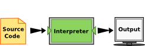
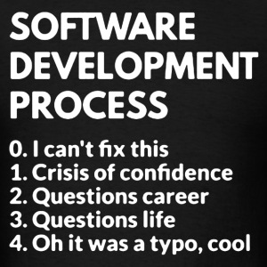

----------
# Extra materials

> 1. [How to Think Like a Computer Scientist: Interactive Edition](https://runestone.academy/runestone/books/published/thinkcspy/index.html)
> 2. [How to Think Like a Computer Scientist: Learning with Python 3](http://openbookproject.net/thinkcs/python/english3e/)
> 3. [Python for Everybody (PY4E)](https://www.py4e.com/lessons)

# Course Outline
## Unit 1
1. **Computing:** the basic principles of working with computers.
2.  **Programming:** the general workflow of writing and running programs. Writing code, compiling it, executing it, and evaluating the results.
3.  **Debugging:** the process of finding and fixing errors in your programs.
## Unit 2
1.  **Procedural Programming:** The general idea of writing sequences of instructions for the computer to perform.
2.  **Variables:** Creating and modifying data in our programs.
3.  **Logical Operators:** Establishing the truth or falsehood of relationships among variables in our programs.
4.  **Mathematical Operators:** Using arithmetic operators (addition, multiplication, etc.) to modify the values of variables in our programs.
## Unit 3
1.  **Control Structures:** The general idea of lines of code that can control other lines of code.
2.  **Conditionals:** Lines of code (called if statements) that check logical expressions to see if certain code blocks should run.
3.  **Loops:** Lines of code that instruct the computer to repeat a block of code until some condition is met.
4.  **Functions:** Miniature programs within a larger program, each with their own input, code, and output.
5.  **Exception Handling:** Lines of code that instruct the computer how to fail gracefully when errors are encountered.
## Unit 4
1.  **Data Structures:** The general idea of data types more complex than individual letters and numbers.
2.  **Strings:** Ordered series of characters that often represent natural human language.
3.  **Lists:** Ordered series of other kinds of data, collected under one variable name and accessed via numeric indices.
4.  **File Input/Output:** Writing a program's data to a file so it can later be re-loaded after the program is closed and reopened.
5.  **Dictionaries:** Pairs of keys and values collected under one variable name, like lists with non-numeric indices.
## Unit 5
1.  **Objects:** Creating and using custom data types so our programs can reason about the world the way we do.
2.  **Algorithms:** Complex sequences of instructions that transform data or generate useful conclusions.
----------


# Unit 1
## Chapter 1.1: Computing
### Programming Vocabulary
- **Code**: Commands given to a computer in order to perform a task.
- **Line of code**: A single command.
- **Program**: A collection of lines of code that serve one or more overall functions.
- **Input** (files, user input, websites) 👉 code 👉 **output** (files, screen, sound)
- **Compile**: To translate human-readable computer code into low-level commands the computer can execute. In the programming flow, this functions as reading over code and looking for errors. (proofreading by compilers)
- **Run/Excution**: Running some code and having it actually perform its operations.
> Compiling just makes sure what we told the program to do makes sense; running checks whether the program actually do what we want it to do.

Compilation could potentially be skipped.
- Languages that require compilation are called **static/compiled**  languages.
- Languages that do not require compilation are called **dynamic/interpreted**  languages.

> Two kinds of programs process high-level languages into low-level languages: **interpreters and compilers**. An interpreter reads a high-level program and executes it. It processes the program a little at a time, alternately reading lines and performing computations. 


> A compiler reads the program and translates it *completely* before the program starts running. In this case, the high-level program is called the **source code**, and the translated program is called the **object code** or the executable. Once a program is compiled, you can execute it repeatedly without further translation. 


> Many modern languages use both processes. They are first compiled into a lower level language, called **byte code**, and then interpreted by a program called a **virtual machine**. *Python uses both processes*, but because of the way programmers interact with it, it is usually considered an interpreted language.


### Programming Language
Categorization of languages: 
- **Static & Dynamic**: whether compilation is required
- **Hight-level languages** involve a great deal of abstraction from the low-level details of the computer like memory, whereas **low-level languages** such as machine languages or assembly languages require these details to be addressed manually.

[Popularity of different languages](https://www.tiobe.com/tiobe-index/)

> C++ and C# are two successors to the programming language C, which is a low-level language used a lot in developing operating systems, video games, and other highly complex programs. C++ adds a few more features to C, while C# is more of a high-level version. Java, C, C++, and C# are static, compiled languages; Python is the top dynamic, scripting language on this list.

### Console vs. GUI
- Graphical user interfaces (GUIs): An output medium that uses more than just text, like forms, buttons, tabs, and more. Eg. a web brower, a word processor like Microsoft Word, a smartphone app, a modern operating system like Windows or Mac OS.
- Console: An output medium for a program to show exclusively text-based output. Eg. command line interfaces like the terminal on a Mac or the command window on a PC.

### Fundations, language, and domain 
- **Foundations** are the *core principles of computing* that transcend specific programming languages.
- These foundational principles are then *implemented* in specific **programming languages**.
- You then *apply* them to a particular **domain**.

### Python
- Python is a **high-level, platform independent** programming language. Python abstracts further away from the inner workings of the computer than lower-level languages (like memory management), thus is easier to use.
- Python is **dynamic & interpreted**, which means that Python will *run our code line by line* when we ask it to without trying to compile it first. That opens up the possibility of using Python in a command line interface where we write and run lines of code one at a time. Whereas in the **scripting mode**, we write a bunch of code, then *run it all at once*.
- The main takeaway of Python being an interpreted language is that we might not be aware of errors until we actually try to run those lines.
 ### Extra materials
1. [How to Think Like a Computer Scientist: Interactive Edition](https://runestone.academy/runestone/books/published/thinkcspy/index.html)
2. [How to Think Like a Computer Scientist: Learning with Python 3](http://openbookproject.net/thinkcs/python/english3e/)

## Chapter 1.2: Programing
- **Programming** is an iterative process of writing code, attempting to run it, and evaluating the results (write⇨run⇨evaluate cycle). Interchangeable with **coding**.
- Work in Small Chunks
- Chaining Together Instructions
- Debugging to address errors, incorrect results

## Chapter 1.3: Debugging
- **Debugging:** Resolving problems in code, whether it be errors thrown in compilation or running or mismatches between the desired and observed output.

> The terms "bug" and "debugging" are popularly attributed to Admiral Grace Hopper in the 1940s. While she was working on a Mark II Computer at Harvard University, her associates discovered a moth stuck in a relay and thereby impeding operation, whereupon she remarked that they were "debugging" the system.



### Types of errors
- **Compilation Errors:** Errors that occur during the computer’s read through of the code. Compilation errors in writing programs are often similar to grammatical errors in writing essays.
  - *sytax errors*: code that doesn't work with the current programming language.
  - *name errors*: code that tries to use something that doesn't exist.
  - *type errors*: code that matches different types together, which doesn't make sense. Depending on the language, some of these might turn up as runtime errors instead.
- **Runtime errors:** Errors that arise when trying to *actually execute* the code. Languages that don't have compilation will only have runtime errors. Even languages that do require compilation can have runtime errors because we can't anticipate every error just by looking at the code.
  - *Divide by zero errors*: code that divides a value by zero.
  - *Null errors*: code that refers to some variable that has no value.
  - *Memory errors*: code that surpasses your computer's memory.

### Types of errors in Python
#### NameError
An error that usually occurs when you use a variable name that doesn't yet exist. When you encounter these, *check first for misspellings*; you very likely might have misspelled a variable name, causing the computer to see it as a completely different variable! If that doesn't work, try to *find where you first defined the variable*.

#### TypeError
An error that occurs when we try to perform an operation on an object that doesn't make sense with the operation, like calculating the length of a number or to print an omelette.
> The function cannot deal with the object.

#### AttributeError
An error occurs when we ask for information *about* a variable that doesn't make sense, like the happiness of a potato or the GPA of a turnip.
> The object does not have the attribute.

#### SyntaxError
An error that occurs when the line of code we've written can't be read by the computer because it doesn't match the computer's expectation for the programming language's grammar.

#### Others
Check the [debugging guide](https://www.cc.gatech.edu/classes/AY2016/cs1301_spring/CS-1301-Debugging-Guide/index.html).

### Basic debugging
- **Print Debugging:** A form of debugging where print statements are added *throughout the code* to check how the program is flowing.
- **Scope Debugging:** A form of debugging where print statements are added to check the status of the *variables in the program at different  stages* to see how they are changing. (Debugging *small sections/scopes* of a program to make sure things have run correctly so far.)
- **Rubber Duck Debugging:** A form of debugging where the programmer explains the logic, goals, and operations to an inanimate listener to methodically step through the code. The point is when faced with a hard to solve problem, try explaining it from scratch. Oftentimes, you'll find the solution.

> Rubber duck debugging was introduced by the 1999 book *The Pragmatic Programmer*, and it refers to a programmer who carried around a rubber duck to which to explain problems. By explaining things to the duck, the programmer often found the solution.

### Advanced debugging
- **Step by step execution**: run your code one line at a time.
- **Variable visualization**: you can view the status of every variable at any time.
- **In-line debugging**: while you're writing code, it'll show you right there if you've done something wrong; visualized very similarly to spell check. It's almost as if the computer is constantly compiling your code, just to make sure it works, while you're writing it.
 
## Chapter 2.1: Procedural Programming
### Function and Method
  - **Function**: A segment of code that performs a specific task, sometimes taking some input and sometimes returning some output.
  - **Method**: A function that is *part of a class* in object-oriented programming (but colloquially, often used interchangeably with function).
### Programming paradigms
  - **Procedural Programming:** where procedural code is the one that directly instructs a device on how to finish a task in logical steps.
  - **Object-Oriented Programming:** A programming paradigm where programmers define custom data types that have custom methods embedded within them. A concept or an abstraction is created before excuting some other commands.
  - **Event-Driven Programming:** A type of programming where the program generally awaits and reacts to events rather than running code linearly.
### Operators
 - **Logical Operators:**
 
 
 - **Mathematical Operators:** + - \* / % **
### Comments and Documentation
- **Comments:** Notes from the programmer supplied in-line alongside the code itself, designated in a way that prevents the computer from reading or attempting to execute them as code. [in-line comments (pound/hash mark #) & block comments]
  
> There exist ways of writing comments that can be pulled out to generate separate, standalone documentation.

- **Documentation:** Collected and set-aside descriptions and instructions for a body of code.
- **Self-Documenting Code:** Code whose variables and functions are named in a way that makes it clear what their underlying content and operations clear to the reader.

> [Supplemental material](https://en.wikibooks.org/wiki/Python_Programming/Source_Documentation_and_Comments)

## Chapter 2.2: Variables
### Basic concepts
- **Variables:** Alphanumeric (letters and numbers) identifiers that hold values, like integers, strings of characters, and dates.
- **Value:** The content of some variable. The variable my_age might hold the value 21. The variable your_name might hold the value “Greymane”.
- **Null:** The “value” a variable has when it doesn’t actually have a value.
- **Naming rules:** 
  1. Variables (as well as functions, methods, classes, and other stuff we'll learn about later) cannot have spaces in them. Variable names can ==only contain letters, numbers, and underscores==.
  2. Variable names must ==start with letters==. Technically underscores are also allowed, but we generally only use those in certain situations.
  3. Variable names must not duplicate certain ==reserved words==.
  4. Names are case sensitive.
  5. A good name is ==self-documenting==.

> [See more on this website.](https://thehelloworldprogram.com/python/python-variable-assignment-statements-rules-conventions-naming/)

    Two common conventions are used if the name has more than one word: camel case and underscores. Each programming language has its own accepted style. **In Python, you should use underscores. In Java and C#, you would use camel case**. Other languages have their own conventions.
  - **Camel case** mushes the words together and capitalizes each word, like this: thisIsMyVariableName. Note that *the first letter of a variable's name is usually in lowercase, while the first letter of a function's name is often in uppercase*.
  - **Underscores** just replaces spaces with underscores, usually keeping the variable name in all-lower case, like this: this_is_my_variable_name.

### Data types
Integer, real number, character, string, boolean...self-defined types...

> [See more on this website.](https://en.wikibooks.org/wiki/Python_Programming/Data_Types)

*In **strongly-typed languages**, assigning a type to a variable is actually a separate step from assigning a value to the variable; and assigning a different type to this variable will cause crashing.*

We can multiply a sequence (string, list...) by an integer, and Python just takes that sequence and repeats it however many times we multiplied it by. But we can't multiply a sequence by a float or a string by a string. Also, when Python is asked to use a boolean like a number (such as multiplying by a boolean), it interprets True as 1 and False as 0.

Now, let's meet a weird guy in Python—the **NoneType**—which only has one value: **None**. None is Python's implementation of the programming concept of [==null==](https://en.wikipedia.org/wiki/Null_pointer) (like the null pointer in C++). This is how Python represents that a variable has no value. This is slightly different from a variable simply not existing: ==the variable name exists, it just doesn't point to any value==. Because there is no value, it also doesn't fit into any of the above types.

**Where Does None Come From?** First, the trivial way, we could just do that intentionally. The way it will happen more commonly is that you'll set it equal to some operation that doesn't result in anything, like you put on the right of an equal sign a function that has no return value (eg. the print() function)

### Type conversion
To treat a certain type of data with operations, functions, or methods of a different data type, we have to use functions for converting between the two. 

> **Implicit conversion:** In practice, you may not always need to do this manually, though. For example, when you put a value other than a string into Python's print function, it automatically tries to convert it to a string.

When we use **comma instead of plus sign**, it tells the print statement to interpret each individual thing in the parentheses as a *separate piece of data*. The print statement ==implicitly converts each thing to a string if needed and then puts them together==. **By default, it puts each thing together separated by a space**.

You'll receive a ==ValueError== whenever you try to do a type conversion, like float or integer, on a value that can't actually be converted to that type.

- ==int(variable)==: Takes as input some variable (usually a string) and attempts to convert it to an integer, returning the integer if successful or raising a ValueError if unsuccessful. This function will work if variable is a string made up **only of digits and, optionally, the negative sign**.

- ==bool(variable)==: Takes as input some variable (usually a string) and attempts to convert it to a boolean, returning the boolean value if successful or raising a ValueError if unsuccessful. **Generally, this function returns False if variable is 0 or an empty string, True if variable is anything else**.

- ==float(variable)==: Takes as input some variable (usually a string/integer) and attempts to convert it to a float, returning the float if successful or raising a ValueError if unsuccessful. This function will work if variable is a string made up **only of digits and, optionally, a negative sign and a decimal point**.

The computer interprets anything that the user enters by the ==input(variable)== function as **a string** of characters because it has no way of knowing that it's a number. So, type conversion is needed under certain circumstances.

### Reserved key words in Python

``` python 
import keyword
print(keyword.kwlist)
```
- Importing Libraries. ==import, from==. 
- Logical Operators. ==and, is, not, or, False, True, None==.
- Control Structures. ==as, break, continue, if, elif, else, for, in, while, pass, with==.
- Functions. ==def, return==.
- Object-Oriented Programming Syntax. ==class==.
- Error Handling. ==except, finally, raise, try==.
- The remaining words: ==assert, del, global, lambda, non-local, yield== are outside of the scope of the course.

If a reserved word is used as a variable name or a function name, a **SyntaxError** will be triggered. But if a function name in Python like print is used for a new variable name, assigning value to this variable will not cause any problem, but we've hidden the fact that it can also be used as a function. It can only mean one thing for a given block of code, and we're changing its meaning. When we try to use the word as a function name, a **TypeError** will arise.

## Appendix 1. Python Translation Guide
### Print Statements and Line-Ending Behaviors
<style>
table th:first-of-type {
    width: 10%;
}
table th:nth-of-type(2) {
    width: 40%;
}
table th:nth-of-type(3) {
    width: 50%;
}
</style>

| **Language** | **Syntax** | **Notes** |
| --- | ----- | --- |
| Python | print("Here's a line of code")<br>print("Here's another one!") | By default, print() adds a line break to the end of the printed text. |
| Java | System.out.println("Here's a line of code");<br>System.out.println("Here's another one!"); | Like Python's print(), Java's System.out.println() adds a line break after the printed text. In contrast, System.out.print() will print some text without creating a new line afterward. |
| C | printf("Here's a line of code");<br>printf("Here's another one!"); | In C, the printf() function does not add a line break after the printed text. To do that, you need to include "\n" inside the printed text itself, e.g. printf("New line please!\n"). |
| C++ | std::cout << "Here's a line of code";<br>std::cout << "Here's another one!"; | Like C, C++'s cout will not add a new line after the printed text. To add one, we would need to write std:cout << "New Line please!\n". |
| C# | Console.WriteLine("Here's a line of code");<br>Console.WriteLine("Here's another one!"); | C#'s Console.WriteLine() function add a line break after the printed text. Like Java, C# also has a Console.Write() function that will write without starting a new line afterward. |
| JavaScript | console.log("Here's a line of code")<br>console.log("Here's another one!") | By default, console.log() adds a line break to the end of the printed text. |
| VB.NET | Console.WriteLine("Here's a line of code")<br>Console.WriteLine("Here's another one!") | C# and VB.NET use the same underlying library, so you'll find that oftentimes syntax like Console.WriteLine is shared between them. |
| Matlab | fprintf("Here's a line of code);<br>fprintf("Here's another one!"); | Like C, Matlab's fprintf will not add a new line after the printed text. To add one, we would need to write fprintf("New Line please!\n"). |
| Swift | print("Here's a line of code")<br>print("Here's another one!") | By default, print() adds a line break to the end of the printed text. |
| Ruby |  puts "Here's a line of code"<br>puts "Here's another one!" | By default, puts adds a line break to the end of the printed text. |

*Scripting languages* (Python, JavaScript) **generally** *do not use a semi-colon to mark the ends of lines*. **Most** *compiled languages* (Java, C, C++, C#) *use semi-colons*. There are exceptions, though; Swift and VB.NET are a compiled languages that do not use semi-colons, while MatLab is a scripting language that does.

### Comment Syntax
Python's comment syntax is in the minority.

| **Language** | **Syntax** | **Notes** |
| --- | --- | --- |
| Python | #This is a comment in Python<br><br>#This is a<br>#multiline comment<br>#in Python | Triple quotes can also be used in Python to create multi-line comments. |
| Java | //This is a comment in Java<br><br>/* <br> \* This is a<br> \* multi-line comment<br> \* in Java<br> */ | The asterisks at the beginning of each line inside the multi-line comment are customary, but not required. Java, C++, JavaScript, and C# use the same syntax. |
| C | /* This is a comment in C*/ <br><br> /\*  This is a<br> * multiline comment<br> * comment in C<br> */ | The asterisks at the beginning of each line inside the multi-line comment are customary, but not required. C does not have a dedicated single-line comment syntax. |
| C++ | //This is a comment in C++<br><br>/*<br> * This is a<br> * multi-line comment<br> * in C++<br> */ | The asterisks at the beginning of each line inside the multi-line comment are customary, but not required. Java, C++, JavaScript, and C# use the same syntax. |
| C# | //This is a comment in C#<br><br>/*<br> * This is a<br> * multi-line comment<br> * in C#<br> */ | The asterisks at the beginning of each line inside the multi-line comment are customary, but not required. Java, C++, JavaScript, and C# use the same syntax. |
| JavaScript | //This is a comment in JavaScript<br><br>/* <br> * This is a<br> * multi-line comment<br> * in JavaScript<br> */  | The asterisks at the beginning of each line inside the multi-line comment are customary, but not required. Java, C++, JavaScript, and C# use the same syntax. |
| VB.NET | 'This is a comment in VB.NET<br><br>'This is a<br>'multiline comment<br>'in VB.NET | VB.NET has no special way of creating multi-line comments. |
| Matlab | %This is a comment in Matlab<br><br>%{<br>This is a<br>multiline comment<br>in Matlab<br>%} |  |
| Swift | //This is a comment in Swift<br><br>/* <br> This is a<br> multi-line comment<br> in Swift<br>*/ | 
| Ruby| # This is a comment in Ruby<br><br>=begin<br>This is a<br>multiline comment<br>in Ruby<br>=end | Ruby is weird. |

### Variable Declarations and Assignments