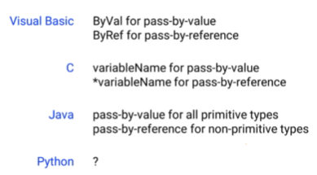

# Unit 4
## Chapter 4.1: Data Structures
Data structures are approaches to organizing abstract data types, such that the data can be accessed efficiently.

- **List-Like Structures:** Also referred to as sequences and collections, a data structure that holds multiple individual values gathered together under one variable name, accessed via indices. This includes structures like **lists, arrays, and tuples**. Lists are simultaneously a general type of data structure and a specific data type in some languages.

- **Index:** A number used to access a particular element from a list-like data structure. Traditionally, most programming languages assign the first item of a list-like data structure the index 0.

- **String:** A data structure that holds a list, or a string, of characters.

- **Lists:** A data structure that holds multiple individual values gathered together under one variable name, accessed via indices. Similar to arrays and tuples.

- **File Input and Output:** The complementary processes of saving data to a file and loading data from a file, generally such that the state of the memory of the program is the same after saving and loading have occurred.

- **Dictionaries:** A data structure comprised of key-value pairs, where a key is entered into the dictionary to get out a value. Similar to or synonymous with Maps, Associative Arrays, HashMaps, and Hashtables.

### Passing by Value vs. Passing by Reference
- **Passing by value**: Values themselves being passed back and forth. The functino never knows your variables and you never know the function's variables. When passing by value, you're simply handing off the value and the function can't actually change your variable.

- **Passing by reference**: The function has access to your actual variables and could modify them. You and the function are accessing the same variables.  When passing by reference, you're handing the variable itself to the function and the function can modify the variable if it wants.

The difference between passing by value and passing by reference comes down to whether or not you want the function to be able to change the values of the variables directly, or if you simply want it to receive the values themselves without being able to access the variables. (whether the function has the direct access to your original files📕)

In some languages like C++, you can choose whether to pass a variable by value or by reference. However, Python deals with passing-by-value and passing-by-reference a little strangely. **In reality, everything is passed by reference**, but *some primitive data types like integers often appear to be passing by value*. This is due to mutability.


### Variable Assignments
When we type down an assignment statement `b = a`, did we assign `a` only to the current value of `b` or does `b` follow `a` around and copy its value whenever it changes? In other words, did we tell `b` you now equal the **current value** of `a` or did we tell `b` you should always equal `a`?
```python
>>> a = 5
>>> b = a
>>> a = 7
a = 7, b = 5
```
```python
>>> a = ["One", "Two", "Three"]
>>> b = a
>>> a.append("Four")
a = ["One", "Two", "Three", "Four"], b = ["One", "Two", "Three", "Four"]
```
There are two important takeaways here: 
1. We can refer to the same data by different names-- we can have multiple variables that point to the same data and if you access and modify the data via one variable name, it also modifies the data for any other variable names that point to the same data.

2. As with our function calls, we see that integers and lists behave differently. An integer will not keep its data up to date if the variable to which it is set changes, but that's not the case for a list. Again, this comes down to mutability.

### Mutability in Python
- **Mutability:** Whether or not a variable can have its value changed after being declared.

- **Mutable Variable:** A variable whose value can change after it has been declared.

- **Immutable Variable:** A variable whose value cannot change after it has been declared.
  
**Python passes all arguments by reference**. But for all practical purposes, some data types seem to be passed by value. The reason they acted this way is because they were **immutable**.

Let's talk about the way Python actually does this. We have a variable called `myInteger`, and we assign it the value `1`, we're telling it to *point to a place in memory that stores the number 1*. When we use `myInteger`, we're actually looking up its value. Now when we say `myInteger` equals `2`, what Python does is kind of weird. It *grabs a new area of memory,* puts the number 2 there, and tells `myInteger` to *point out that new location instead of the old location*. What that means is that the old value is still there in memory. The value didn't change. We didn't change the number `1`. Instead, we just created a new place in memory and told `myInteger` to point to that instead. **Changing the value of myInteger changes the spot in memory that it points to, but it doesn't actually change the value stored in the original spot of memory**. Note that a function can't change what value the variable used in the main program is pointing to. It can only change the value its own copy of that variable is pointing to. (Because the scope of variables defined in the function were until the function ended.)

 The computer has to have some way of identifying the location in memory that stores the data. Multiple names or different names can point to the same place in memory, so the place memory really needs **a fundamental unchangeable name**. This is called a **memory address**. It tells the computer where to find a particular value for a particular variable name.
```python
print(id(variable/value))  # Printing Memory Addresses
```

> - Immutable data types: integers, float, strings (Changing them changes the address where they can be found, seem like passing by value.)
> - Mutable data types: lists (Changing them **does not** change the address where they can be found. note that it's **changing/modifying** them, **not reassigning** them to a whole new value.)
> - Immutable variables pointing to the same value have the same id; however, for mutable variables, even they point to the same value, they have different ids, enless they are connected by `=`

### Functions vs. Methods 
Methods are functions accessed through dot notation; they are functions contained within data types. Just like functions, methods can return certain types of data as well.
```python 
str.isdigit()  # a Boolean method, check to see if a string represents a number, returns either a true or a false value
 
str.isupper()  # a Boolean method, check to see if all the letters in the string are uppercase, returns either a true or a false value
```

### External Materials
🐍[Basic Data Structures](https://runestone.academy/runestone/books/published/pythonds/BasicDS/toctree.html)
🐍[Python Data Structures](https://python.swaroopch.com/data_structures.html)

## Chapter 4.2: Strings
### Basic Concepts
- **String:** A data structure that holds a list of characters.
- **Character:** A single letter, number, symbol, or special character.
- **Unicode:** A computing industry standard that sets what hexadecimal codes correspond to what characters, so that text appears consistent across platforms. (263A should be a simple smiley emoji 😊)
- **Hexadecimal:** A short-hand expression of the ones and zeroes that comprise computer data, comprised of 16 characters, 0 through 9 and A through F.
- **Special Characters:** Tab, Newline characters (carriage returns & line feed)
- **Newline Character:** A Unicode character, either LF (line feed) or CR (carriage return), that is rendered as the beginning of a new line of text. (Mac uses LF to represent its newline while Windows uses both LF and CR.)

### Declare Strings
- Python won't terminate the string until it encounters the same mark that you used to start the string `'`,`'''`,`"`.
- When a string is declared with triple quotation marks or triple apostrophe's, everything inside them will be interpreted as part of the string.
```python
s = '''123
	   456'''
----------
123
456
```

### String Concatenation and Slicing
- Concatenation: use plus operator.
- Sliceing: Remember that string is a kind of list, so we can use `string[start:end]`[start, end) to slice strings (a positive number counts from the beginning, a negative number counts from the end.). Remember also, strings are an immutable type. That means we can't modify their values. **We can only use [ ] to access individual characters but not modify them**.

### String Searching
The `in` operator can be used with strings to check if a substring is part of a string.

The **find method** `string.find(text, [start], [end])` is a member of the string type, and it takes as input the substring we want to find. It returns **the first index** where that substring was found or -1 if it wasn't found anywhere. We can use **a while loop** to get all the indices that the targeted substring has appeared.
```python
myString = "ABCDEEDGHYRCDELKCDEJNCECDEGGHEDCDEPJ"
findString = "CED"
currentLocation = 0
while currentLocation >= 0:
	print(findString, "found at", currentLocation)
	currentLocation = myString.find(findString, currentLocation+len(findString))
```
If we just care about how many times the targeted substring has appeared in the given string, we can use the **count method**. The count method will count the number of times the string in parentheses occurs inside the string calling count.
`myString.count(findString, [start], [end])`

### Other Useful String Methods

> 🐍[String Methods at Python.org](https://docs.python.org/3.7/library/stdtypes.html#string-methods)
- `string.split([separator])` The split method divides the string calling it into several substrings based on the separator character and returns to a string list. The default separator is space. If we use **period** as the separator, every sentence except the first will start with an empty space. Second, there will be an empty string at the end, because **Python sees the period at the end of the string, and at that point, it closes off the previous string and starts a new one.** It doesn't know that it's not going to find anything in that new one. And so we end up with an extra empty string at the end of our list. The solution is to use **period space** `', '` as the separator.
- `string.capitalize()` capitalizes the string
- `string.lower()` all-lowercase version
- `string.upper()` all-uppercase version
- `string.title()` capitalizes any character found after a space
- `string.strip([character])` strips out any whitespace before or after the string. We could also supply an argument to strip, to strip out a different character. But if we don't, it assumes to strip out spaces.
- `string.replace(string1, string2)` replaces string1 with string2
- `string.join(list)` uses the string calling the join method to concatenate each item from the list of strings
> Split and join are basically reverses of each other.

Notice that string methods **do not** actually change the value of the string. They just return what would be the value if that operation was applied. To actually save it, we would have to define antoher string and assign the return value of the string method to that newly defined string.

### External Materials
🐍 [Strings, from How to Think Like a Computer Scientist](https://runestone.academy/runestone/books/published/thinkcspy/Strings/toctree.html)

## Chapter 4.3: Lists
### Basics
- **List-like Structures:** Also referred to as sequences and collections, a data structure that holds multiple individual values gathered together under one variable name, accessed via indices. It would encompass other data structures like dictionaries and maps.
- **Homogeneity:** A property of lists determining whether they can accept multiple types of variables. A homogenous list can only accept one type of variable; a nonhomogenous or heterogenous list can accept multiple types.

Nearly every programming language has some concept of a list, but the terminology and the specific details differ significantly. **One major way different languages differ in their implementations of lists is mutability.** Mutability of a list involces: 
1) whether the values of the list can be changed
2) whether the size of the list can be changed

Some list implementations will allow us to append new items to the end, while others require you to state in advance how many items can fit in the list. Generally, the latter is more common for lower level languages like C where we manage memory more deliberately.

**Another major way list-like structures may differ is whether they accept multiple data types**. This is called **homogeneity and lists**. In some list implementations, every item in a list must be the same type. Other languages don't have this restriction.

> A **list** is a data structure that contains multiple values **accessed via an ordered numerical index**. This is in contrast to **dictionaries and hash tables and other data structures**. They can also contain multiple values, but they can be **accessed via non-numeric indices**.

List-like structures can go by various different names like *lists, arrays, tuples, vectors, tables, and more*. Oftentimes, *array* is used to refer to a more primitive structure that *only supports changing the existing values*, whereas *list* refers to more complex data structures that *support sorting and inserting and other operations*. *Tuples* are, most often, *immutable*.

### Tuples in Python
>🐍 [Documentation on tuples from Python.org.](https://docs.python.org/3/tutorial/datastructures.html#tuples-and-sequences)
- **Tuple:** An immutable form of a list-like structure in Python. Like strings, we can't add values to the end of a tuple and we can't change the current values of anything inside the tuple or sort them.
- **Lists:** A mutable form of a list-like structure in Python.

Declare a tuple: `tuple = (value1, value2, value3)`

Tuples can have multiple data types within them. This follows Python's general procedure of being what we call **loosely typed**. Python never really cares about what data types you're using until you try to do something that you can't do, like multiplying a string by a float, or printing the length of an integer.

Tuples can be accessed and sliced as other list-like data structures. However, they also have a fancy little syntax for **unpacking**: `(variable1, variable2, variable3) = tuple` What this does is it one by one assigns the values of the tuple to the different variables contained on the right side of this assignment statement.

The most usefulness of tuples may be functions. Generally functions can only return one variable or one value. But since tuples can pack multiple values into just one, they in some way let us return multiple values  out of a function: 
```python
def function(args):
	function body
	return (value1, value2, value3)  # return a tuple allows a function to return multiple values
	
(variable1, variable2, variable3) = function(args)  # assignment using tuple unpacking
```
Tuples can be nested. You can have a tuple of tuples. How to access an individual value inside of a nested tuple: use two sets of brackets. `tuple[num1][num2]` The first one specifies which tuple we want and the second one specifies which value from that tuple we want.

### Lists in Python
> 🐍[Documentation on lists from Python.org](https://docs.python.org/3.7/tutorial/datastructures.html).

Everything we've seen in the past with both strings and tuples can also be used for lists. The only real difference is that whereas we define a string with quotation marks and a tuple with parentheses, we define a list with brackets. (access, slice, unpacking, function return, nested...)

What differentiates lists is that they're **mutable**. That means we can change their values. We can add values to them, we can remove values from them, we can change the current value of certain values in the list. We can reorder them.

```python
list.sort()  # A method inside the list data type and sorts the values according to some internal logic. For integers it just sorts from the lowest to the highest (ascending). 

list.reverse()  # reverses the current order of the list, not necessarily the sorted order of the list.

list1.extend(list2)  # takes the values of list2 and puts them
at the end of list1.

list.insert(location, value)  # inserts an item at a certain place in the list.

list.remove(value)  # removes a certain value.

del list[]  # deletes items by location in the list.

list.pop([index=-1])  # removes the last item (by default) of the list and returns it, index is optional.

list.index(value)  # finds the index of a certain value.

list.count(value)  # counts how many times a certain value appears.
```

> It's important to note that **calling the method actually changes the value of the list**. Remember, when we called methods on strings they didn't change the value of the string. That's because lists are mutable, and strings are immutable.

Lists are mutable. That means if we pass a list to a function or method and change the values of the list, those changes will persist out to our main program. So when dealing with lists, or any other mutable data type, we have to be careful to understand that all modifications we make to the list will persist.

### Lists vs. Tuples
Generally, though, there are a couple conventions we follow to decide whether to use lists or tuples:

1. We often use tuples when we're definitely dealing with a pre-determined number of items. We use lists when the ability to add or remove from the list would actually be useful and relevant.

2. We usually use lists when the individual things on the list are qualitatively similar. We use tuples if they're qualitatively different. 

3. **Lists are used for alike data types** by convention because we tend to *execute the same body of code* for each item in the list. Tuples are more often used to represent information that's unpacked into unique variables, those have qualitatively different meanings. And so you're not going to just run some code on every item in a tuple. For that same reason, it's more normal for **tuples to have different data types** within them because we're not generally expecting to be able to iterate over a tuple in the same way.

### Stacks: LIFO Structures
“Last-In-First-Out” (LIFO) paradigm.

1. We can only access the *most recently-added* (newest) item on the list;
2. We can only access it by removing it from the list.

E.g., putting dishes in the sink one on top of the other as they get dirty, then washing them when the sink gets full.

### Queues: FIFO Structures
“First-In-First-Out” (FIFO) paradigm.

1. We can only access the *least recently-added* (oldest) item on the list;
2. We can only access it by removing it from the list.

### Linked List
A list-like structure where the **location** of each item in the list is contained in the previous item in the list.

In a list, each spot tends to be a reference to a particular spot in memory that might be **completely disconnected** to the other ones. In effect, each spot in the list is more like an individual variable name that **could point to anywhere in memory**.

In a linked list, on the other hand, it only has one item that points to a place in memory. The first one. What would make it unique is that instead of the second spot pointing to the second address, it would be data contained in the first spot that point to the second address. Each value of the list contains the location of the next value of the list.

E.g., going on a scavenger hunt where each clue features a puzzle you must solve to find the next clue.

### External Materials
🐍 [Lists, from How to Think Like a Computer Scientist](http://interactivepython.org/courselib/static/thinkcspy/Lists/toctree.html)
🐍[Google for Education](https://developers.google.com/edu/python/lists)
🐍[The Geek Stuff](https://www.thegeekstuff.com/2013/06/python-list/?utm_source=feedly)
🐍[18 Most Common Python List Questions](https://www.datacamp.com/community/tutorials/18-most-common-python-list-questions-learn-python#gs.=H0VpEs)
