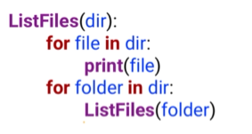

# Unit 5
## Chapter 5.1: Objects
### Basic Concepts
- **Object-oriented programming:** A programming paradigm where programmers define custom data types that have custom methods embedded within them.

- **Object:** An object is a custom data structure that organizes and encapsulates variables and methods into a single data type. It is used near-interchangeably with “instance.” It's like the general 'prototype' or 'template'.

- **Class:** A custom data type comprised of multiple variables and/or methods. Instances or objects are created based on the template provided by the class. A class is a generic structure for a certain kind of data. An instance, on the other hand, is a specific example.

### Classes and Instances in Python
```python
#Define the class Name
class Name:
    def __init__(self):
        self.firstname = "[no first name]"
        self.lastname = "[no last name]"

#Define the class Person
class Person:
    #Create a new instance of Person
    def __init__(self):
        #Person's default values
        self.name = Name()
        self.eyecolor = "[no eye color]"
        self.age = -1
		
#Create a new Person and assign it to myPerson
myPerson = Person()  # with default values
#Print myPerson's name's firstname
print(myPerson.name.firstname)
#Change myPerson's name's firstname to David
myPerson.name.firstname = "David"
#Print myPerson's name's firstname
print(myPerson.name.firstname)
```
`__init__` is called whenever we create a new instance of a class. It initializes an instance of that class.

`self` is a keyword that tells Python to define variables for the instance as a whole. Any other code inside this class would be able to see those variables, as long as it accessed them with `self` as well. Besides, because it starts with `self`, the variable age exists, as long as this class or this instance exists. But if we left off `self`, then the variable would cease to exist at the end of this method. 

**Every method defined inside a class should have self as the first parameter.** We'll never have to pass in an argument for it though. Self by default just sees all the variables associated with this instance of the class. Preceding these variable names with the word self just tells Python that the scope of these variables is the entire lifespan of this instance of the class.

When we call the class name to create an instance, the color of the class name that was called is the same as `__init__`. The reason is that when we call the class, it actually calls our init function. This creates a new instance of this class and then returns that instance to be set equal to the variable name on the left.

Benefits of using objects instead of dictionaries:
1. With a dictionary, we might not have created a certain key. But with classes, we guarantee that every variable created in that initializer actually exists.

2. Classes can have methods as well as variables. Dictionaries were purely ways of organizing data, but that data couldn't do anything on its own. Dictionaries only store data, whereas classes can themselves act on data.

### Common Method Types
**Constructor:** A common type of method in writing classes that specifies some code to automatically run whenever a new instance of the class is created. The constructor often has parameters that provide values to initialize the variables defined by the class.

**Destructor:** A common type of method in writing classes that specifies how the instance of a class is to be destroyed/deleted, such as releasing its memory back to the computer. Destructors can be useful if you're dealing with massive quantities of data and find yourself running out of computer memory.

**Getter:** A common type of method in writing classes that returns the value of a variable contained within the class. They are commonly used to allow other processing to occur whenever the variable is accessed, like logging.

**Setter:** A common type of method in writing classes that sets a variable contained within the class to a new value. They are commonly used to allow other processing to occur whenever the variable is changed, like logging.

### Encapsulating Methods in Classes
Encapsulation: The ability to combine variables and methods into class definitions in object-oriented programming. It helps avoid modification or misuse of data by other functions or programs.

Methods are what make encapsulation truly powerful in classes. A method is a function defined inside of a class. The method scope is defined as the normal scope of a function for that language plus any variables that are visible in the instance of the class as a whole.

In practice, the four common method types we've' discussed above -- constructors, destructors, getters, and setters -- are more important to other languages than to Python. Constructors are present, but you'll rarely use destructors in Python; and getters and setters are antithetical to "Pythonic" thinking.

Python doesn't provide *privacy* options for its variables and methods.
There is no way to bindingly mark a variable or method in a Python class as private, meaning that other code can always access variables directly. By convention, we often **perceive variables or methods that we don't want other classes or functions to access with a double underscore**. The double underscore simply informs other areas of the code that those methods or variables are not meant to be used to access data that way.

`__init__` is the constructor in Python. And as a function defined inside of a class, it has a parameter list. Self is always the first parameter for any method that we define inside of a class, but it doesn't have to be the only one.

```python
#Define the class Person
class Person:
    #Create a new instance of Person
    def __init__(self, firstname="[no first name]",
                 lastname="[no last name"):
        self.firstname = firstname
        self.lastname = lastname
        self.eyecolor = "[no eye color]"
        self.age = -1

myPerson1 = Person()
print(myPerson1.firstname)  # [no first name]
myPerson2 = Person(firstname = "David")
print(myPerson2.firstname)  # David
myPerson3 = Person("Vrushali")
print(myPerson3.firstname)  # Vrushali
```
Part of the benefit of getters and setters was that they allow us to run some code whenever a variable is accessed or modified.

```python
#Define class BankAccount
class BankAccount:
    #Initialize balance to 0
    def __init__(self, name, balance = 0.0):
        self.log("Account created!")
        self.name = name
        self.balance = balance

    def getBalance(self): #Getter for balance
        self.log("Balance checked at " + str(self.balance))
        return self.balance

    def setBalance(self, newBalance): #Setter for balance
        self.log("Balance changed to " + str(newBalance))
        self.balance = newBalance

    def log(self, message): #Logging method
        myLog = open("Log.txt", "a")
        print(message, file = myLog)
        myLog.close()

myBankAccount = BankAccount("David Joyner")
myBankAccount.setBalance(20.0)
print(myBankAccount.getBalance())
```
The `log()` method will take as a parameter, the message
to be logged; and its operation is to automatically open my log,
print the message to that log, and then close that log. So every time an account is created, or the balance is checked, or the balance is changed, those operations will get logged to my log file.

`getBalance()` is a getter for getting the balance. Its main function is to return the balance, which is the same thing as accessing the balance directly. It's also going to log every time the balance is checked.

`setBalance()` is a setter that sets the value equal to a new balance, and it also logs that as well.

We could actually create methods to do whatever we want. And in fact, if we were really designing a bank account class like we were designing here, we probably don't want a set balance method. How often do we just wipe out the previous balance and set it equal to a new value. That's not the way we usually use bank accounts. Usually we use them by making deposits and making withdrawals.

```python
class BankAccount:
    def __init__(self, name, balance = 0.0):
        self.log("Account created!")
        self.name = name
        self.balance = balance

    def getBalance(self):
        self.log("Balance checked at " + str(self.balance))
        return self.balance

    def deposit(self, amount):
        self.balance += amount
        self.log("+" + str(amount) + ": " + str(self.balance))

    def withdraw(self, amount):
        self.balance -= amount
        self.log("-" + str(amount) + ": " + str(self.balance))

    def log(self, message): #Logging method
        myLog = open("Log.txt", "a")
        print(message, file = myLog)
        myLog.close()

myBankAccount = BankAccount("David Joyner")
myBankAccount.deposit(20.0)
print(myBankAccount.getBalance())
myBankAccount.withdraw(10.0)
print(myBankAccount.getBalance())
```
### Advanced Topics in Classes in Python
Combining Classes:
```python
 1| class Name:
 2|     def __init__(self, firstname, lastname):
 3|         self.firstname = firstname
 4|         self.lastname = lastname
 5|
 6| class Student:
 7|     def __init__(self, studentName, enrolled):
 8|         self.studentName = studentName
 9|         self.GPA = 0.0
10|         self.creditHours = 0
11|         self.enrolled = enrolled
12|         self.classes = []

# Legal ways to create a new instance of Student:
newStudent = Student(Name("David", "Joyner"), True)

newName = Name("David", "Joyner")
newStudent = Student(newName, True)

newStudent = Student("David Joyner", True)
```
Instances as arguments (1)
```python
class Person:
    def __init__(self, name, age, father=None, mother=None):
        self.name = name
        self.age = age
        self.father = father
        self.mother = mother

person1=Person("Mr. Burdell",53)
person2=Person("Mrs. Burdell",53)
george_p=Person("George P. Burdell",25,person1, person2)
print(george_p.name)
print(george_p.mother.name)
print(george_p.father.name)
```
Instance Assignments: when we assign an already existed instance to a new instance, we've given the new one access to the old one's actual variables (they're pointing through the same variable name). So if the new one changes the variables, it changes them from the old one as well. **Lists, dictionaries, objects, and most other data types in Python behave this way: they are mutable.**

Instances as arguments (2)
```python
class Person:
    def __init__(self, name, eyecolor, age):
        self.name = name
        self.eyecolor = eyecolor
        self.age = age

class Name:
    def __init__(self, firstname, lastname):
        self.firstname = firstname
        self.lastname = lastname
		
def capitalizeName(name):
    name.firstname = name.firstname.upper()
    name.lastname = name.lastname.upper()
	
def capitalizeString(instring):
    instring = instring.upper()

myPerson = Person(Name("David", "Joyner"), "brown", 30)
capitalizeName(myPerson.name)
print(myPerson.name.firstname)  # DAVID
print(myPerson.name.lastname)  # JOYNER
capitalizeString(myPerson.name.firstname)
capitalizeString(myPerson.name.lastname)
print(myPerson.name.firstname)  # David
print(myPerson.name.lastname)  # Joyner
```
When we passed in an instance of the name object, `capitalizeName` actually has access to the original variables and can change them. It's not just changing its own local copy, it's changing the real values of the variables. And so we see in the end that the strings themselves have been converted to all capital letters. It's not actually changing the firstname and lastname, it's changing what `name.firstname` and `name.lastname` point at.

But when we have `capitalizeString` instead of `capitalizeName`, we pass the strings for first name and last name directly instead of passing the name object that contains them. The result here is exactly the opposite, and the reason is that strings are immutable. Here, though, it doesn't have access to name dot anything. So it can't change what name is pointing at. It tries to change the value of the string itself, but it has no access to the original variable name, so it can't actually change the values of first name and last name as far as name is concerned.

So the takeaway here is that **any operations we make on mutable objects**, like name, **propagate back out to the code that called that function. Any operations we make to immutable types**, like just the plain string, **do not propagate out to our main function or to our main code.**

Then what do you do if you want to make an actual copy of an instance, such that you can actually modify it separately? The basic principle is that you must **copy it at the level of the immutable data types** (string and integer are immutable, but self-defined classes are mutable). We have to construct a new instance of person and pass in those immutable data types as arguments, as opposed to just setting `myPerson2` directly equal to `myPerson1`. This forces the computer to create a new instance of person, with its own variables for name, eye color, and age.
```python
class Person:
    def __init__(self, name, eyecolor, age):
        self.name = name
        self.eyecolor = eyecolor
        self.age = age

class Name:
    def __init__(self, firstname, lastname):
        self.firstname = firstname
        self.lastname = lastname

myPerson1 = Person(Name("David", "Joyner"), "brown", 30)
myPerson2 = Person(myPerson1.name, myPerson1.eyecolor, myPerson1.age)  # myPerson1.name is not at the level of the immutable types
myPerson3 = Person(Name(myPerson1.name.firstname, myPerson1.name.lastname), myPerson1.eyecolor, myPerson1.age)  # a real copy
myPerson2.eyecolor = "black"
myPerson3.eyecolor = "blue"
print(myPerson1.eyecolor)  # brown
print(myPerson2.eyecolor)  # black
print(myPerson3.eyecolor)  # blue
myPerson3.name.firstname = "Vrushali"
print(myPerson1.name.firstname)  # David
print(myPerson3.name.firstname)  # Vrushali
myPerson2.name.firstname = "Ryan"
print(myPerson1.name.firstname)  # Ryan
print(myPerson2.name.firstname)  # Ryan
```
### Polymorphism and Inheritance and Abstraction
**Abstraction:** A principle of object-oriented programming that states that only essential information should be made visible to the outside program. Certain variables only makes sense at certain levels of abstraction.

**Polymorphism:** The principle that a method call can behave differently depending on the arguments and object with which it is called. Polymorphism describes the ability to write a method in each class that would allow drastically dissimilar objects to be accessed and used in the same way.

**Inheritance:** A principle of object-oriented programming where classes can be created that are “subclasses” of other classes, inheriting all the variables and methods from the other class while supplying new variables, methods, or behaviors of these own. Inheritance is the idea that an object can inherit certain variables and methods from its parent.

### External Materials
🐍[Classes and Objects - the Basics](http://interactivepython.org/courselib/static/thinkcspy/ClassesBasics/toctree.html) and [Classes and Objects - Digging a Little Deeper](http://interactivepython.org/courselib/static/thinkcspy/ClassesDiggingDeeper/toctree.html), from *How to Think Like a Computer Scientist*

## Chapter 5.2: Algorithms
**Algorithm:** Technically, a collection of steps that transforms input into output; commonly, a complex set of lots of steps that is only feasible to perform with the efficiency of a computer.  They generally exist separate and apart from our particular computer implementation of them.

Famous Algorithms:
- **Data compression:** taking very large files and communicating them with a fraction of the data in a way that loses as little actual meaning as possible. Algorithms responsible for effective compression are used to run video streaming services, online multiplayer games, and more.

- **Random number generation:** algorithms that take some variable input and use it to algorithmically replicate something resembling truly random numbers.

- **Search algorithms:** search in the way that in internet search engines. Algorithms underlie Google's efforts to predict what you're searching for based on your keywords, relationships between websites, and past users experiences.

### Complexity and Big O Notation
**Complexity:** The rate at which the number of operations requires to run an algorithm grows based on the value of the input on which it operates. Usually when discussing complexity we talk in terms of worst case scenarios, also known as "upper bounds" on how long something could take.

**Big O Notation:** A notation for expressing the **worst-case efficiency** of an algorithm in terms of the size of the input.

Big o is a measure of algorithmic complexity. In big o we ask, given a data set of size n, how many operations are required to complete this algorithm? However, what we're really interested in with big o notation, are differences of **orders of magnitude**. So it's common to *leave out the coefficients* and describe algorithms simply as having o of terms just related to n (e.g., n squared) complexity. In fact, the "o" in big o notation,
stands for the **order of the function**.

There also exist **Big Ω (Omega) Notation**, which expresses the **best-case efficiency** of an algorithm, and **Big θ (Theta) Notation**, which expresses the **typical-case efficiency** of an algorithm. *Big O is used most commonly.*

These various values exist, though, because some algorithms are generally very efficiency, but are very inefficient with certain types of data. For example, there exists a sorting algorithm called QuickSort that is generally extremely efficient, but whose efficiency plummets if there are a lot of duplicate values in the data set that it's sorting.

Common Big O Values:
<style>
table th:first-of-type {
    width: 10%;
}
table th:nth-of-type(2) {
    width: 20%;
}
table th:nth-of-type(3) {
    width: 35%;
}
</style>

| Name | Big O Notation | Definition | Example |
| :---: | :---: | --- | --- |
| Constant |`!$O(1)$` | The same number of operations is required regardless of the size of the data set. | "Is the first name in the data set 'David'?" |
| Linear |`!$O(n)$` | The number of operations required increases linearly with the size of the data set. | "Is the name 'David' in this unsorted list of names?" (Linear Search) |
| Quadratic |`!$O(n^2)$` | The number of operations required increases with the size of the data set squared. | "Are there any duplicate names in this unsorted list of names?" (Double-Linear Search) |
| Polynomial |`!$O(n^3)$` | The number of operations required increases with the size of the data set raised to a larger exponent. | "Are there any triple duplicate names in this unsorted list of names?" (Triple-Linear Search) |
| Exponential |`!$O(2^n)$` | The number of operations required increases by a constant raised to the size of the data set. | "What is every possible 10-digit password?" |
| Logarithmic |`!$O(log(n))$` | The number of operations required increases with the square root of the size of the data set. | "Is the name 'David' in this sorted list of names?" (Binary Search) |
| Loglinear |`!$O(nlog(n))$` | The number of operations required increases with square root of the size of the data set times the size of the data set. (tends to be the optimal efficiency for most sorting algorithms) | "Sort this list of names." (Merge Sort) |
| Factorial |`!$O(n!)$` | The number of operations required increases with the factorial of the size of the data set. (tends to come up a lot in recursive algorithms) | "What is shortest possible route among these multiple destinations?" |

### Recursion
> 🤡 The definition of recursion is "see the definition of recursion".

Recursion is a programming method characterized by functions that, during their operation, call additional copies of themselves; see also, recursion. Recursion involves breaking down a problem into smaller instances recursively until each of them can be independently solved. Solutions to these smaller instances combine to form the solution for the original problem. It keeps calling another version of itself until it reaches some default condition. 

This is a little bit related to our idea of a **stack**. We kept adding new functions on top of the stack until we reached the bottom. And then we removed them in the opposite order from how we added them. This is why we noted that the stack was more common than the queue in computing, where calls are added to the top until one is ready to return something.  The important thing is that **the first one to return was the last one to be called.** Examples include facrotial,  Fibonacci sequence

The recursive implementation of Fibonacci is very inefficient. We could make it more efficient if we replace these calls of Fibonacci directly with a function that looks up and sees "have I already calculated the Fibonacci number at this location?" And if so, just go ahead and grab that value instead of recalculating it manually. We would probably do that with a *dictionary*, where the keys in the dictionary are locations in the sequence and the values are the Fibonacci numbers at those locations. In doing so, we remove all those duplicate calls to Fibonacci with the same value that are used before.

**Head recursion and tail recursion**: Head recursion occurs when the recursive call is near the beginning of the function, before other reasoning or code. Tail recursion occurs when the recursive call is closer to the end of the function, after some other reasoning or code.

Notice that the way I've written this function right now it would first print all the files in the current folder and then it would dive into the sub folders. So if we ran this we would see all the files and directory first, followed by all the files in the first folder found within directory, followed by all the files found in the first folder within that folder, and so on. If I had reversed these though, then it would first print the files located in the deepest subfolder of directory. And the very last thing it would do is print the files located in the current directory itself. That's because it would be making that recursive function call at the beginning instead of at the end. Calling the recursive function as shown here, at the end, is called tail recursion. Whereas if it was at the start, it would be called head recursion.

### Sorting Algorithms
Sorting Algorithms take as input a list, and produce as output a sorted version of that list. The only stipulation is the algorithm must have some way to judge whether one item is greater than, less than, or equal to another. Examples include bubble sort,  insertion sort, selection sort, merge sort, shell sort, quick sort, and heap sort.

> 🥇For some awesome visualizations of sorting algorithms in action, check out [Toptal's web site](https://www.toptal.com/developers/sorting-algorithms).

#### Bubble Sort
- Difficulty: ⭐
- Complexity: `!$O(n^2)$`

- Implementation: iterate through each item in the list one pair at a time. If that pair were in the wrong order then switch them. Repeat that process so long as a switch occurred the previous time we went through the list. When no switches are required, then that means the list was sorted. **Each time we go through the list, the bubble sort finds the largest number that has not been in the right place and puts it into the right spot by switching pairs**.

The benefit of bubble sort is that it's actually pretty easy to write. It's effectively-- for each number in the list swap it if it's greater than the next number, and keep a running Boolean that says true if any swaps were necessary. You reset that boolean to false at the end of each execution, but rerun the bubble sort if it was true at the end of the execution. The drawback of a bubble sort is it's actually pretty inefficient. A lot of swaps were unnecessary. So it's probably the easiest sort to implement, but it also operates in an inefficient time--o of n squared.


