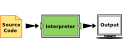
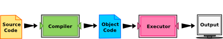
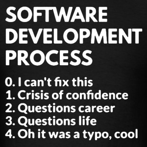

----------

# Course Outline
## Unit 1
1. **Computing:** the basic principles of working with computers.
2.  **Programming:** the general workflow of writing and running programs. Writing code, compiling it, executing it, and evaluating the results.
3.  **Debugging:** the process of finding and fixing errors in your programs.
## Unit 2
1.  **Procedural Programming:** The general idea of writing sequences of instructions for the computer to perform.
2.  **Variables:** Creating and modifying data in our programs.
3.  **Logical Operators:** Establishing the truth or falsehood of relationships among variables in our programs.
4.  **Mathematical Operators:** Using arithmetic operators (addition, multiplication, etc.) to modify the values of variables in our programs.
## Unit 3
1.  **Control Structures:** The general idea of lines of code that can control other lines of code.
2.  **Conditionals:** Lines of code (called if statements) that check logical expressions to see if certain code blocks should run.
3.  **Loops:** Lines of code that instruct the computer to repeat a block of code until some condition is met.
4.  **Functions:** Miniature programs within a larger program, each with their own input, code, and output.
5.  **Exception Handling:** Lines of code that instruct the computer how to fail gracefully when errors are encountered.
## Unit 4
1.  **Data Structures:** The general idea of data types more complex than individual letters and numbers.
2.  **Strings:** Ordered series of characters that often represent natural human language.
3.  **Lists:** Ordered series of other kinds of data, collected under one variable name and accessed via numeric indices.
4.  **File Input/Output:** Writing a program's data to a file so it can later be re-loaded after the program is closed and reopened.
5.  **Dictionaries:** Pairs of keys and values collected under one variable name, like lists with non-numeric indices.
## Unit 5
1.  **Objects:** Creating and using custom data types so our programs can reason about the world the way we do.
2.  **Algorithms:** Complex sequences of instructions that transform data or generate useful conclusions.
----------

# Unit 1
## Chapter 1.1: Computing
### Programming Vocabulary
- **Code**: Commands given to a computer in order to perform a task.
- **Line of code**: A single command.
- **Program**: A collection of lines of code that serve one or more overall functions.
- **Input** (files, user input, websites) 👉 code 👉 **output** (files, screen, sound)
- **Compile**: To translate human-readable computer code into low-level commands the computer can execute. In the programming flow, this functions as reading over code and looking for errors. (proofreading by compilers)
- **Run/Excution**: Running some code and having it actually perform its operations.
> Compiling just makes sure what we told the program to do makes sense; running checks whether the program actually do what we want it to do.

Compilation could potentially be skipped.
- Languages that require compilation are called **static/compiled**  languages.
- Languages that do not require compilation are called **dynamic/interpreted**  languages.

> Two kinds of programs process high-level languages into low-level languages: **interpreters and compilers**. An interpreter reads a high-level program and executes it. It processes the program a little at a time, alternately reading lines and performing computations. 

> A compiler reads the program and translates it *completely* before the program starts running. In this case, the high-level program is called the **source code**, and the translated program is called the **object code** or the executable. Once a program is compiled, you can execute it repeatedly without further translation. 

> Many modern languages use both processes. They are first compiled into a lower level language, called **byte code**, and then interpreted by a program called a **virtual machine**. *Python uses both processes*, but because of the way programmers interact with it, it is usually considered an interpreted language.

### Programming Language
Categorization of languages: 
- **Static & Dynamic**: whether compilation is required
- **Hight-level languages** involve a great deal of abstraction from the low-level details of the computer like memory, whereas **low-level languages** such as machine languages or assembly languages require these details to be addressed manually.

[Popularity of different languages](https://www.tiobe.com/tiobe-index/)

> C++ and C# are two successors to the programming language C, which is a low-level language used a lot in developing operating systems, video games, and other highly complex programs. C++ adds a few more features to C, while C# is more of a high-level version. Java, C, C++, and C# are static, compiled languages; Python is the top dynamic, scripting language on this list.

### Console vs. GUI
- Graphical user interfaces (GUIs): An output medium that uses more than just text, like forms, buttons, tabs, and more. Eg. a web brower, a word processor like Microsoft Word, a smartphone app, a modern operating system like Windows or Mac OS.
- Console: An output medium for a program to show exclusively text-based output. Eg. command line interfaces like the terminal on a Mac or the command window on a PC.

### Fundations, language, and domain 
- **Foundations** are the *core principles of computing* that transcend specific programming languages.
- These foundational principles are then *implemented* in specific **programming languages**.
- You then *apply* them to a particular **domain**.

### Python
- Python is a **high-level, platform independent** programming language. Python abstracts further away from the inner workings of the computer than lower-level languages (like memory management), thus is easier to use.
- Python is **dynamic & interpreted**, which means that Python will *run our code line by line* when we ask it to without trying to compile it first. That opens up the possibility of using Python in a command line interface where we write and run lines of code one at a time. Whereas in the **scripting mode**, we write a bunch of code, then *run it all at once*.
- The main takeaway of Python being an interpreted language is that we might not be aware of errors until we actually try to run those lines.
 ### Extra materials
1. [How to Think Like a Computer Scientist: Interactive Edition](https://runestone.academy/runestone/books/published/thinkcspy/index.html)
2. [How to Think Like a Computer Scientist: Learning with Python 3](http://openbookproject.net/thinkcs/python/english3e/)

## Chapter 1.2: Programing
- **Programming** is an iterative process of writing code, attempting to run it, and evaluating the results (write⇨run⇨evaluate cycle). Interchangeable with **coding**.
- Work in Small Chunks
- Chaining Together Instructions
- Debugging to address errors, incorrect results

## Chapter 1.3: Debugging
- **Debugging:** Resolving problems in code, whether it be errors thrown in compilation or running or mismatches between the desired and observed output.

> The terms "bug" and "debugging" are popularly attributed to Admiral Grace Hopper in the 1940s. While she was working on a Mark II Computer at Harvard University, her associates discovered a moth stuck in a relay and thereby impeding operation, whereupon she remarked that they were "debugging" the system.

### Types of errors
- **Compilation Errors:** Errors that occur during the computer’s read through of the code. Compilation errors in writing programs are often similar to grammatical errors in writing essays.
  - *sytax errors*: code that doesn't work with the current programming language.
  - *name errors*: code that tries to use something that doesn't exist.
  - *type errors*: code that matches different types together, which doesn't make sense. Depending on the language, some of these might turn up as runtime errors instead.
- **Runtime errors:** Errors that arise when trying to *actually execute* the code. Languages that don't have compilation will only have runtime errors. Even languages that do require compilation can have runtime errors because we can't anticipate every error just by looking at the code.
  - *Divide by zero errors*: code that divides a value by zero.
  - *Null errors*: code that refers to some variable that has no value.
  - *Memory errors*: code that surpasses your computer's memory.

### Types of errors in Python
#### NameError
An error that usually occurs when you use a variable name that doesn't yet exist. When you encounter these, *check first for misspellings*; you very likely might have misspelled a variable name, causing the computer to see it as a completely different variable! If that doesn't work, try to *find where you first defined the variable*.

#### TypeError
An error that occurs when we try to perform an operation on an object that doesn't make sense with the operation, like calculating the length of a number or to print an omelette.
> The function cannot deal with the object.

#### AttributeError
An error occurs when we ask for information *about* a variable that doesn't make sense, like the happiness of a potato or the GPA of a turnip.
> The object does not have the attribute.

#### SyntaxError
An error that occurs when the line of code we've written can't be read by the computer because it doesn't match the computer's expectation for the programming language's grammar.

### Basic debugging
- **Print Debugging:** A form of debugging where print statements are added *throughout the code* to check how the program is flowing.
- **Scope Debugging:** A form of debugging where print statements are added to check the status of the *variables in the program at different  stages* to see how they are changing. (Debugging *small sections* of a program to make sure things have run correctly so far.)
- **Rubber Duck Debugging:** A form of debugging where the programmer explains the logic, goals, and operations to an inanimate listener to methodically step through the code. The point is when faced with a hard to solve problem, try explaining it from scratch. Oftentimes, you'll find the solution.

> Rubber duck debugging was introduced by the 1999 book *The Pragmatic Programmer*, and it refers to a programmer who carried around a rubber duck to which to explain problems. By explaining things to the duck, the programmer often found the solution.