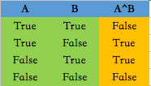

# Microsoft
## 经典题目
### [53. 最大子序和](https://leetcode-cn.com/problems/maximum-subarray/solution/zui-da-zi-xu-he-by-leetcode-solution/)
> 知识点：数组；前缀和；哨兵；动态规划；贪心；分治
- 题目描述：

给你一个整数数组 nums ，请你找出一个具有最大和的连续子数组（子数组最少包含一个元素），返回其最大和。

示例 1：
```
输入：nums = [-2,1,-3,4,-1,2,1,-5,4]
输出：6
解释：连续子数组 [4,-1,2,1] 的和最大，为 6 。
```
示例 2：
```
输入：nums = [1]
输出：1
```
示例 3：
```
输入：nums = [5,4,-1,7,8]
输出：23
```

- 提示：

1 <= nums.length <= 105
104 <= nums[i] <= 104

- 进阶：如果你已经实现复杂度为 O(n) 的解法，尝试使用更为精妙的 分治法 求解。

法一：动态规划，复杂度`!$O(n)$`
```python

```


# 算法面试题汇总
## 开始之前
### 136. [只出现一次的数字](https://leetcode-cn.com/problems/single-number/solution/zhi-chu-xian-yi-ci-de-shu-zi-by-leetcode-solution/)
> 知识点：异或、位运算、集合
- 题目描述：

给定一个非空整数数组，除了某个元素只出现一次以外，其余每个元素均出现两次。找出那个只出现了一次的元素。 

示例 1: 
```
输入: [2,2,1] 
输出: 1 
```
示例 2: 
```
输入: [4,1,2,1,2] 
输出: 4 
```
- 说明： 

你的算法应该具有线性时间复杂度。 你可以不使用额外空间来实现吗？ 

- 代码：
```python
class Solution:
    def singleNumber(self, nums: List[int]) -> int:
        target=0
        for i in range(len(nums)):
            target=target^nums[i]
        return target
```
> 🐍Python 异或（exclusive or，^）：**A B有且仅有一者为真**
> 🐍计算过程：基于二进制基础上，将A ^ B **按位**异或的过程为，先将A和B分别转换为二进制，按位异或得到结果后再组合起来，最后转换为十进制。
> 
> 🐍例如：5 ^ 3 的结果为6是因为
> 5 = 0101(b)
> 3 = 0011(b)
> 0^0 ->0
> 1^0 ->1
> 0^1 ->1
> 1^1 ->0
> 0110(b) 转换为十进制：6
> 🐍规律总结：
> a ^ a = 0；自异或结果为0
> a ^ 0 = a；与0异或结果为自身
> a ^ b ^ c = a ^ c ^ b；异或运算具有交换律


