# Microsoft
## 主题要点
无论你是面试什么岗位，面试官基本都会从以下几个方面全面考察候选人的技术水平。当然，除了这些面试考点以外，你还需要了解目标岗位的其他技术要求，及时查漏补缺，充分备战技术面试。
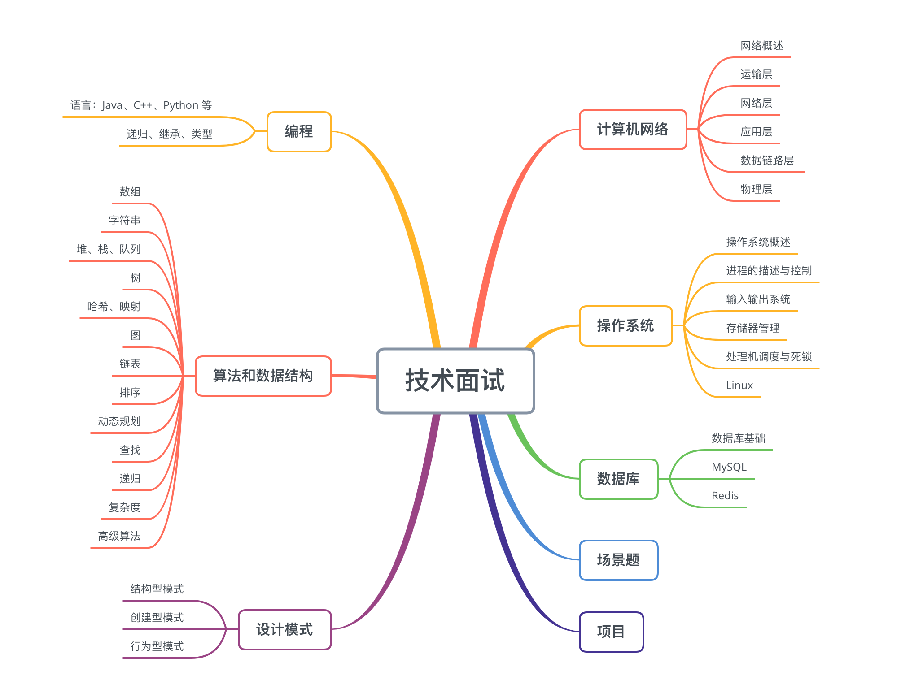
算法和数据结构一直是技术面试的重点和难点。近年来，很多知名企业如谷歌, 脸书等在面试过程中都会有特定的电话面试环节, 专门用来面算法题。这些企业通常会使用在线协同代码编程网站，需要面试者用一小时解决 4 道算法问题，面试官可以实时看到候选人所写的代码。除了远程面试外, 在 Onsite 面试中还会有白板写代码等环节。
 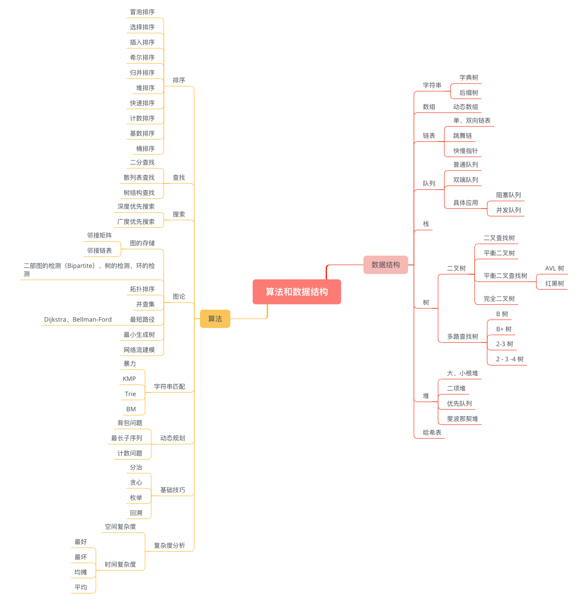
 
## 名企面试重点梳理
与其他公司相比，头部互联网公司对面试者的算法水平要求更高，经常出中等及以上难度的题目。不止要求面试者能写出算法，还要求时间复杂度最小，找出最优方式，这就需要我们针对一道题目思考多种解决办法；同时需要注意算法中对异常情况的处理。
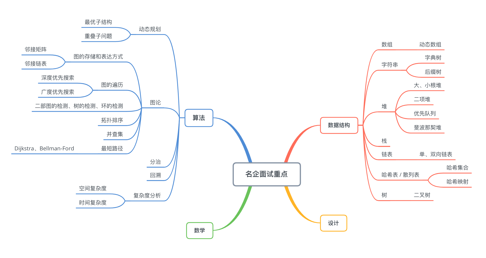
除了这些算法外，有的面试官还会临时给一些有规律的数据，让你写出一种算法或给出思路，考验你的逻辑思维能力。想要锻炼算法思维，在学习过程中，需要先掌握一类算法，钻研透了再去掌握另一类，这样在遇到新问题时才能举一反三。在面试中如果遇到卡壳的情况也不用太紧张，面试官会给你一定的提示，你可以根据已掌握的算法，尽量说出解题思路，在思考的过程中也能消除紧张，也许很快就能想出问题的解答思路。

## 经典题目
### 53. 最大子序和 (Easy)
> [力扣链接](https://leetcode-cn.com/problems/maximum-subarray/solution/zui-da-zi-xu-he-by-leetcode-solution/)
> 知识点：数组；动态规划；贪心；分治
#### 题目描述
给你一个整数数组 nums ，请你找出一个具有最大和的连续子数组（子数组最少包含一个元素），返回其最大和。

示例 1：
```
输入：nums = [-2,1,-3,4,-1,2,1,-5,4]
输出：6
解释：连续子数组 [4,-1,2,1] 的和最大，为 6 。
```
示例 2：
```
输入：nums = [1]
输出：1
```
示例 3：
```
输入：nums = [5,4,-1,7,8]
输出：23
```
提示：
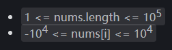

进阶：如果你已经实现复杂度为 O(n) 的解法，尝试使用更为精妙的 分治法 求解。

#### 题解
法一：动态规划
时间复杂度`!$O(n)$`，空间复杂度`!$O(1)$`
```python
class Solution:
    def maxSubArray(self, nums: List[int]) -> int:
        pre, maxValue = 0, nums[0]
        for i in range(len(nums)):
            pre = max(pre+nums[i], nums[i])
            maxValue = max(maxValue, pre)
        return maxValue
```

### 88. 合并两个有序数组 (Easy)
> [力扣链接](https://leetcode-cn.com/problems/merge-sorted-array/solution/he-bing-liang-ge-you-xu-shu-zu-by-leetco-rrb0/)
> 知识点：数组；双指针；排序
#### 题目描述
给你两个按 **非递减顺序** 排列的整数数组 nums1 和 nums2，另有两个整数 m 和 n ，分别表示 nums1 和 nums2 中的元素数目。请你 合并 nums2 到 nums1 中，使合并后的数组同样按 非递减顺序 排列。

注意：最终，合并后数组不应由函数返回，而是存储在数组 nums1 中。为了应对这种情况，nums1 的初始长度为 m + n，其中前 m 个元素表示应合并的元素，后 n 个元素为 0 ，应忽略。nums2 的长度为 n 。

示例 1：
```
输入：nums1 = [1,2,3,0,0,0], m = 3, nums2 = [2,5,6], n = 3
输出：[1,2,2,3,5,6]
解释：需要合并 [1,2,3] 和 [2,5,6] 。
合并结果是 [1,2,2,3,5,6] ，其中斜体加粗标注的为 nums1 中的元素。
```
示例 2：
```
输入：nums1 = [1], m = 1, nums2 = [], n = 0
输出：[1]
解释：需要合并 [1] 和 [] 。
合并结果是 [1] 。
```
示例 3：
```
输入：nums1 = [0], m = 0, nums2 = [1], n = 1
输出：[1]
解释：需要合并的数组是 [] 和 [1] 。
合并结果是 [1] 。
注意，因为 m = 0 ，所以 nums1 中没有元素。nums1 中仅存的 0 仅仅是为了确保合并结果可以顺利存放到 nums1 中。
```

提示：
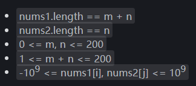

进阶：你可以设计实现一个时间复杂度为 O(m + n) 的算法解决此问题吗？

#### 题解
法一：直接合并排序（略）
时间复杂度`!$O((m+n)log(m+n))$`，空间复杂度`!$O(log(m+n))$`

法二：双指针
时间和空间复杂度均为`!$O(m+n)$`
```python
class Solution:
    def merge(self, nums1: List[int], m: int, nums2: List[int], n: int) -> None:
        """
        Do not return anything, modify nums1 in-place instead.
        """
        sorted = []
        p1, p2 = 0, 0
        while p1 < m or p2 < n:
            if p1 == m:
                sorted.append(nums2[p2])
                p2 += 1
            elif p2 == n:
                sorted.append(nums1[p1])
                p1 += 1
            elif nums1[p1] < nums2[p2]:
                sorted.append(nums1[p1])
                p1 += 1
            else:
                sorted.append(nums2[p2])
                p2 += 1
        nums1[:] = sorted
```
法三：双向逆指针，从后向前遍历两个数组，取两者之中的较大者放进nums1的最后面，避免直接覆盖nums1中的元素
时间复杂度`!$O(m+n)$`，空间复杂度`!$O(1)$`
```python
class Solution:
    def merge(self, nums1: List[int], m: int, nums2: List[int], n: int) -> None:
        """
        Do not return anything, modify nums1 in-place instead.
        """
        p1, p2 = m - 1, n - 1
        tail = m + n - 1
        while p1 >= 0 or p2 >= 0:
            if p1 == -1:
                nums1[tail] = nums2[p2]
                p2 -= 1
            elif p2 == -1:
                nums1[tail] = nums1[p1]
                p1 -= 1
            elif nums1[p1] > nums2[p2]:
                nums1[tail] = nums1[p1]
                p1 -= 1
            else:
                nums1[tail] = nums2[p2]
                p2 -= 1
            tail -= 1
```

### 121. 买卖股票的最佳时机 (Easy)
> [力扣链接](https://leetcode-cn.com/problems/best-time-to-buy-and-sell-stock/solution/121-mai-mai-gu-piao-de-zui-jia-shi-ji-by-leetcode-/)
> 知识点：数组
#### 题目描述
给定一个数组 prices ，它的第 i 个元素 prices[i] 表示一支给定股票第 i 天的价格。你只能选择 某一天 买入这只股票，并选择在 未来的某一个不同的日子 卖出该股票。设计一个算法来计算你所能获取的最大利润。

返回你可以从这笔交易中获取的最大利润。如果你不能获取任何利润，返回 0 。

示例 1：
```
输入：[7,1,5,3,6,4]
输出：5
解释：在第 2 天（股票价格 = 1）的时候买入，在第 5 天（股票价格 = 6）的时候卖出，最大利润 = 6-1 = 5 。
     注意利润不能是 7-1 = 6, 因为卖出价格需要大于买入价格；同时，你不能在买入前卖出股票。
```
示例 2：
```
输入：prices = [7,6,4,3,1]
输出：0
解释：在这种情况下, 没有交易完成, 所以最大利润为 0。
```
提示：
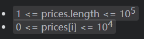

#### 题解
法一：一次遍历，找到历史最低点
时间复杂度`!$O(n)$`
```python
class Solution:
    def maxProfit(self, prices: List[int]) -> int:
		inf = int(1e9)
        min_price = inf
        max_profit = 0
        for price in prices:
            max_profit = max(price - min_price, max_profit)
            min_price = min(price, min_price)
        return max_profit
```

### 125. 验证回文串 (Easy)
> [力扣链接](https://leetcode-cn.com/problems/valid-palindrome/solution/yan-zheng-hui-wen-chuan-by-leetcode-solution/)
> 知识点：字符串，双指针
#### 题目描述
给定一个字符串，验证它是否是回文串，只考虑字母和数字字符，可以忽略字母的大小写。

说明：本题中，我们将空字符串定义为有效的回文串。

示例 1：
```
输入: "A man, a plan, a canal: Panama"
输出: true
解释："amanaplanacanalpanama" 是回文串
```
示例 2：
```
输入: "race a car"
输出: false
解释："raceacar" 不是回文串
```
提示：


#### 题解
法一：字符串反转
时间复杂度`!$O(|s|)$`，空间复杂度`!$O(|s|)$`
```python
class Solution:
    def isPalindrome(self, s: str) -> bool:
        sgood = "".join(ch.lower() for ch in s if ch.isalnum())
    	return sgood == sgood[::-1]
```
法二：双指针
时间复杂度`!$O(|s|)$`，空间复杂度`!$O(|s|)$`
```python
class Solution:
    def isPalindrome(self, s: str) -> bool:
        sgood = "".join(ch.lower() for ch in s if ch.isalnum())
        n = len(sgood)
        left, right = 0, n - 1
        
        while left < right:
            if sgood[left] != sgood[right]:
                return False
            left, right = left + 1, right - 1
        return True
```

### 107. 二叉树的层序遍历 Ⅱ (Medium)
> [力扣链接](https://leetcode-cn.com/problems/binary-tree-level-order-traversal-ii/solution/er-cha-shu-de-ceng-ci-bian-li-ii-by-leetcode-solut/)
> 知识点：树；广度优先搜索
#### 题目描述
给定一个二叉树，返回其节点值自底向上的层序遍历。 （即按从叶子节点所在层到根节点所在的层，逐层从左向右遍历）

例如：给定二叉树 [3,9,20,null,null,15,7],
```
    3
   / \
  9  20
    /  \
   15   7
```
返回其自底向上的层序遍历为：
```
[
  [15,7],
  [9,20],
  [3]
]
```
#### 题解
法一：广度优先搜索
时间复杂度 $O(n)$，空间复杂度 $O(n)$
```python
# Definition for a binary tree node.
# class TreeNode:
#     def __init__(self, val=0, left=None, right=None):
#         self.val = val
#         self.left = left
#         self.right = right
class Solution:
    def levelOrderBottom(self, root: TreeNode) -> List[List[int]]:
        if not root: return []  # root为空的情况           
        levelOrder = []
        q = collections.deque([root])
        while q:
            level = []
            size = len(q)
            for i in range(size):
                node = q.popleft()
                level.append(node.val)
                if node.left:
                    q.append(node.left)
                if node.right:
                    q.append(node.right)
            levelOrder.append(level)
        return levelOrder[::-1]  # 倒序返回；102删掉此行即可
```
> [🐱‍💻拓展1-代码随想录以一打八](https://leetcode-cn.com/problems/binary-tree-level-order-traversal-ii/solution/er-cha-shu-ceng-xu-bian-li-deng-chang-wo-yao-da-2/)
> 
> [🐱‍💻拓展2-代码随想录二叉树](https://www.programmercarl.com/%E4%BA%8C%E5%8F%89%E6%A0%91%E7%90%86%E8%AE%BA%E5%9F%BA%E7%A1%80.html#%E4%BA%8C%E5%8F%89%E6%A0%91%E7%9A%84%E7%A7%8D%E7%B1%BB)

### 138. 复制带随机指针的链表 (Medium)
> [力扣链接](https://leetcode-cn.com/problems/copy-list-with-random-pointer/solution/liang-chong-shi-xian-tu-jie-138-fu-zhi-dai-sui-ji-/)
> 知识点：哈希表；链表

#### 题目描述
给你一个长度为 n 的链表，每个节点包含一个额外增加的随机指针 `random` ，该指针可以指向链表中的任何节点或空节点。 构造这个链表的 **深拷贝**。 深拷贝应该正好由 n 个 **全新** 节点组成，其中每个新节点的值都设为其对应的原节点的值。新节点的 `next` 指针和 `random` 指针也都应指向复制链表中的新节点，并使原链表和复制链表中的这些指针能够表示相同的链表状态。**复制链表中的指针都不应指向原链表中的节点** 。 

例如，如果原链表中有 X 和 Y 两个节点，其中 `X.random --> Y` 。那么在复制链表中对应的两个节点 x 和 y ，同样有 `x.random --> y` 。 返回复制链表的头节点。 用一个由 n 个节点组成的链表来表示输入/输出中的链表。每个节点用一个 `[val, random_index]` 表示： 
- `val`：一个表示 `Node.val` 的整数。 
- `random_index`：随机指针指向的节点索引（范围从 0 到 n-1）；如果不指向任何节点，则为  null 。

你的代码 只 接受原链表的头节点 `head` 作为传入参数。

示例1：
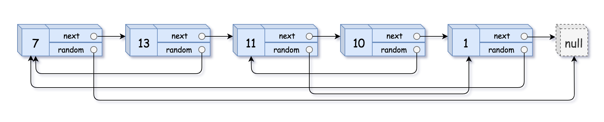
```
输入：head = [[7,null],[13,0],[11,4],[10,2],[1,0]]
输出：[[7,null],[13,0],[11,4],[10,2],[1,0]]
```
示例2：

```
输入：head = [[1,1],[2,1]]
输出：[[1,1],[2,1]]
```
示例3：

```
输入：head = [[3,null],[3,0],[3,null]]
输出：[[3,null],[3,0],[3,null]]
```
示例4：
```
输入：head = []
输出：[]
解释：给定的链表为空（空指针），因此返回 null。
```
提示：
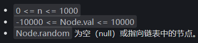

#### 题解
法一：哈希表 (字典)
时间复杂度 `!$O(n)$`，空间复杂度 `!$O(n)$`

首先创建一个哈希表，再遍历原链表，遍历的同时再不断创建新节点
我们将原节点作为key，新节点作为value放入哈希表中
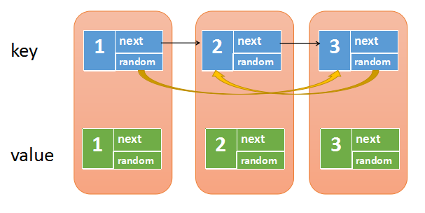
第二步我们再遍历原链表，这次我们要将新链表的next和random指针给设置上
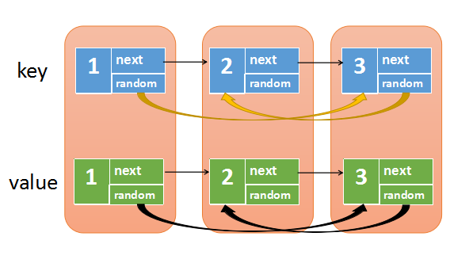
从上图中我们可以发现，原节点和新节点是一一对应的关系，所以
- map.get(原节点)，得到的就是对应的新节点
- map.get(原节点.next)，得到的就是对应的新节点.next
- map.get(原节点.random)，得到的就是对应的新节点.random

所以，我们只需要再次遍历原链表，然后设置：
- 新节点.next -> map.get(原节点.next)
- 新节点.random -> map.get(原节点.random)

这样新链表的next和random都被串联起来了

最后，我们返回map.get(head)，也就是对应的新链表的头节点，就可以解决此问题了。

```python
"""
# Definition for a Node.
class Node:
    def __init__(self, x: int, next: 'Node' = None, random: 'Node' = None):
        self.val = int(x)
        self.next = next
        self.random = random
"""
class Solution(object):
    def copyRandomList(self, head):
        if not head:
            return None
        # 创建一个哈希表，key是原节点，value是新节点    
        d = dict()
        p = head
        # 将原节点和新节点放入哈希表中
        while p:
            new_node = Node(p.val,None,None)
            d[p] = new_node
            p = p.next
        p = head
        # 遍历原链表，设置新节点的next和random
        while p:
            # p是原节点，d[p]是对应的新节点，p.next是原节点的下一个
            # d[p.next]是原节点下一个对应的新节点
            if p.next:
                d[p].next = d[p.next]
            # p.random是原节点随机指向
            # d[p.random]是原节点随机指向  对应的新节点    
            if p.random:
                d[p].random = d[p.random]
            p = p.next
        # 返回头结点，即原节点对应的value(新节点)
        return d[head]
```
法二：有丝分裂
时间复杂度 $O(n)$，空间复杂度 $O(1)$
```python
"""
# Definition for a Node.
class Node:
    def __init__(self, x: int, next: 'Node' = None, random: 'Node' = None):
        self.val = int(x)
        self.next = next
        self.random = random
"""
class Solution(object):
    def copyRandomList(self, head):
        if not head:
            return None
        p = head
        # 第一步，在每个原节点后面创建一个新节点
        # 1->1'->2->2'->3->3'
        while p:
            new_node = Node(p.val,None,None)
            new_node.next = p.next
            p.next = new_node
            p = new_node.next
        p = head
        # 第二步，设置新节点的随机节点
        while p:
            if p.random:
                p.next.random = p.random.next
            p = p.next.next
        # 第三步，将两个链表分离
        p = head
        dummy = Node(-1,None,None)
        cur = dummy
        while p:
            cur.next = p.next
            cur = cur.next
            p.next = cur.next
            p = p.next
        return dummy.next	
```

### 146. LRU缓存机制 (Medium)
> [力扣链接](https://leetcode-cn.com/problems/lru-cache/solution/lruhuan-cun-ji-zhi-by-leetcode-solution/)
> 知识点：哈希表；链表
#### 题目描述
请你设计并实现一个满足  LRU (最近最少使用) 缓存 约束的数据结构。
实现 LRUCache 类：
- `LRUCache(int capacity)` 以 **正整数** 作为容量 `capacity` 初始化 LRU 缓存
- `int get(int key)` 如果关键字 `key` 存在于缓存中，则返回关键字的值，否则返回 `-1` 。
- `void put(int key, int value)` 如果关键字 `key` 已经存在，则变更其数据值 `value` ；如果不存在，则向缓存中插入该组 `key-value` 。如果插入操作导致关键字数量超过 `capacity` ，则应该 逐出 最久未使用的关键字。

函数 `get` 和 `put` 必须以 `!$O(1)$` 的平均时间复杂度运行。

示例：
```
输入
["LRUCache", "put", "put", "get", "put", "get", "put", "get", "get", "get"]
[[2], [1, 1], [2, 2], [1], [3, 3], [2], [4, 4], [1], [3], [4]]
输出
[null, null, null, 1, null, -1, null, -1, 3, 4]

解释
LRUCache lRUCache = new LRUCache(2);
lRUCache.put(1, 1); // 缓存是 {1=1}
lRUCache.put(2, 2); // 缓存是 {1=1, 2=2}
lRUCache.get(1);    // 返回 1
lRUCache.put(3, 3); // 该操作会使得关键字 2 作废，缓存是 {1=1, 3=3}
lRUCache.get(2);    // 返回 -1 (未找到)
lRUCache.put(4, 4); // 该操作会使得关键字 1 作废，缓存是 {4=4, 3=3}
lRUCache.get(1);    // 返回 -1 (未找到)
lRUCache.get(3);    // 返回 3
lRUCache.get(4);    // 返回 4
```
提示：
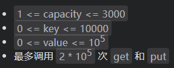

#### 题解
法一：哈希表 + 双向链表
```python
class DLinkedNode:
    def __init__(self, key=0, value=0):
        self.key = key
        self.value = value
        self.prev = None
        self.next = None


class LRUCache:

    def __init__(self, capacity: int):
        self.cache = {}
        # 使用伪头部和伪尾部节点    
        self.head = DLinkedNode()
        self.tail = DLinkedNode()
        self.head.next = self.tail
        self.tail.prev = self.head
        self.capacity = capacity
        self.size = 0

    def get(self, key: int) -> int:
        if key not in self.cache:
            return -1
        # 如果 key 存在，先通过哈希表定位，再移到头部
        node = self.cache[key]
        self.moveToHead(node)
        return node.value

    def put(self, key: int, value: int) -> None:
        if key not in self.cache:
            # 如果 key 不存在，创建一个新的节点
            node = DLinkedNode(key, value)
            # 添加进哈希表
            self.cache[key] = node
            # 添加至双向链表的头部
            self.addToHead(node)
            self.size += 1
            if self.size > self.capacity:
                # 如果超出容量，删除双向链表的尾部节点
                removed = self.removeTail()
                # 删除哈希表中对应的项
                self.cache.pop(removed.key)
                self.size -= 1
        else:
            # 如果 key 存在，先通过哈希表定位，再修改 value，并移到头部
            node = self.cache[key]
            node.value = value
            self.moveToHead(node)
    
    def addToHead(self, node):
        node.prev = self.head
        node.next = self.head.next
        self.head.next.prev = node
        self.head.next = node
    
    def removeNode(self, node):
        node.prev.next = node.next
        node.next.prev = node.prev

    def moveToHead(self, node):
        self.removeNode(node)
        self.addToHead(node)

    def removeTail(self):
        node = self.tail.prev
        self.removeNode(node)
        return node
```

### 200. 岛屿数量 (Medium)
> [力扣链接](https://leetcode-cn.com/problems/number-of-islands/solution/dao-yu-shu-liang-by-leetcode/)
> 知识点：深度优先搜索；广度优先搜索；并查集
#### 题目描述
给你一个由 '1'（陆地）和 '0'（水）组成的的二维网格，请你计算网格中岛屿的数量。

岛屿总是被水包围，并且每座岛屿只能由水平方向和/或竖直方向上相邻的陆地连接形成。

此外，你可以假设该网格的四条边均被水包围。

示例1：
```
输入：grid = [
  ["1","1","1","1","0"],
  ["1","1","0","1","0"],
  ["1","1","0","0","0"],
  ["0","0","0","0","0"]
]
输出：1
```
示例2：
```
输入：grid = [
  ["1","1","0","0","0"],
  ["1","1","0","0","0"],
  ["0","0","1","0","0"],
  ["0","0","0","1","1"]
]
输出：3
```
提示：
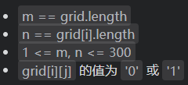

#### 题解
法一：深度优先搜索-DFS (借助栈/递归实现)
时间复杂度 `!$O(MN)$`，空间复杂度 `!$O(MN)$`
```python
class Solution:
    def numIslands(self, grid: [[str]]) -> int:
        def dfs(grid, i, j):
            if not 0 <= i < len(grid) or not 0 <= j < len(grid[0]) or grid[i][j] == '0': return
            grid[i][j] = '0'
            dfs(grid, i + 1, j)
            dfs(grid, i, j + 1)
            dfs(grid, i - 1, j)
            dfs(grid, i, j - 1)
        count = 0
        for i in range(len(grid)):
            for j in range(len(grid[0])):
                if grid[i][j] == '1':
                    dfs(grid, i, j)
                    count += 1
        return count
```
法二：广度优先搜索-BFS (借助队列实现)
时间复杂度 `!$O(MN)$`，空间复杂度 `!$O(min(M,N))$`
```python
class Solution:
    def numIslands(self, grid: [[str]]) -> int:
        def bfs(grid, i, j):
            queue = [[i, j]]
            while queue:
                [i, j] = queue.pop(0)
                if 0 <= i < len(grid) and 0 <= j < len(grid[0]) and grid[i][j] == '1':
                    grid[i][j] = '0'
                    queue += [[i + 1, j], [i - 1, j], [i, j - 1], [i, j + 1]]
        count = 0
        for i in range(len(grid)):
            for j in range(len(grid[0])):
                if grid[i][j] == '0': continue
                bfs(grid, i, j)
                count += 1
        return count
```

### 42. 接雨水 (Hard)
> [力扣链接](https://leetcode-cn.com/problems/trapping-rain-water/solution/jie-yu-shui-by-leetcode/)
> 知识点：栈；双指针
#### 题目描述
给定 n 个非负整数表示每个宽度为 1 的柱子的高度图，计算按此排列的柱子，下雨之后能接多少雨水。

示例1：

```
输入：height = [0,1,0,2,1,0,1,3,2,1,2,1]
输出：6
解释：上面是由数组 [0,1,0,2,1,0,1,3,2,1,2,1] 表示的高度图，在这种情况下，可以接 6 个单位的雨水（蓝色部分表示雨水）。
```
示例2：
```
输入：height = [4,2,0,3,2,5]
输出：9
```
提示：
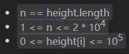

#### 题解
法一：双指针
时间复杂度 `!$O(n)$`，空间复杂度 `!$O(1)$`
```python
class Solution:
    def trap(self, height: List[int]) -> int:
        ans = 0
        left, right = 0, len(height) - 1
        leftMax = rightMax = 0

        while left < right:
            leftMax = max(leftMax, height[left])
            rightMax = max(rightMax, height[right])
            if height[left] < height[right]:
                ans += leftMax - height[left]
                left += 1
            else:
                ans += rightMax - height[right]
                right -= 1
        
        return ans
```
法二：单调栈
```python
class Solution:
    def trap(self, height: List[int]) -> int:
        ans = 0
        stack = []
        n = len(height)
        for i, h in enumerate(height):
            while stack and h > height[stack[-1]]:
                top = stack.pop()
                if not stack:
                    break
                left = stack[-1]
                currWidth = i - left - 1
                currHeight = min(height[left], height[i]) - height[top]
                ans += currWidth * currHeight
            stack.append(i)
        
        return ans
```
### 76. 最小覆盖子串 (Hard)
> [力扣链接](https://leetcode-cn.com/problems/minimum-window-substring/solution/zui-xiao-fu-gai-zi-chuan-by-leetcode-solution/)
> 知识点：哈希表；字符串；滑动窗口
#### 题目描述

#### 题解


## 数组
### 寻找两个正序数组的中位数 (Hard)

### 盛最多水的容器

### 15. 三数之和 (Medium)
> [力扣链接](https://leetcode-cn.com/problems/minimum-window-substring/solution/zui-xiao-fu-gai-zi-chuan-by-leetcode-solution/)
> 知识点：哈希表；字符串；滑动窗口
#### 题目描述
给你一个包含 n 个整数的数组 nums，判断 nums 中是否存在三个元素 a，b，c ，使得 a + b + c = 0 ？请你找出所有和为 0 且不重复的三元组。

注意：答案中不可以包含重复的三元组。

示例 1：
```
输入：nums = [-1,0,1,2,-1,-4]
输出：[[-1,-1,2],[-1,0,1]]
```
示例 2：
```
输入：nums = []
输出：[]
```
示例 3：
```
输入：nums = [0]
输出：[]
```

提示：
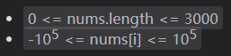

#### 题解
法一：排序+双指针
时间复杂度`!$O(n^2)$`，空间复杂度`!$O(1)$`
```python
class Solution:
    def threeSum(self, nums: List[int]) -> List[List[int]]:
        
        n=len(nums)
        res=[]
        if(not nums or n<3):
            return []
        nums.sort()
        res=[]
        for i in range(n):
            if(nums[i]>0):
                return res
            if(i>0 and nums[i]==nums[i-1]):
                continue
            L=i+1
            R=n-1
            while(L<R):
                if(nums[i]+nums[L]+nums[R]==0):
                    res.append([nums[i],nums[L],nums[R]])
                    while(L<R and nums[L]==nums[L+1]):
                        L=L+1
                    while(L<R and nums[R]==nums[R-1]):
                        R=R-1
                    L=L+1
                    R=R-1
                elif(nums[i]+nums[L]+nums[R]>0):
                    R=R-1
                else:
                    L=L+1
        return res
```

### 下一个排列

### 搜索旋转排序数组

### 在排序数组中查找元素的第一个和最后一个位置

### 54. 螺旋矩阵 (Medium)
> [力扣链接](https://leetcode-cn.com/problems/spiral-matrix/solution/)
> 知识点：矩阵
#### 题目描述
给你一个 m 行 n 列的矩阵 matrix ，请按照 顺时针螺旋顺序 ，返回矩阵中的所有元素。

示例 1：
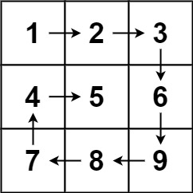
```
输入：matrix = [[1,2,3],[4,5,6],[7,8,9]]
输出：[1,2,3,6,9,8,7,4,5]
```
示例 2：
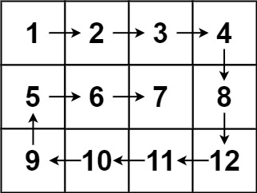
```
输入：matrix = [[1,2,3,4],[5,6,7,8],[9,10,11,12]]
输出：[1,2,3,4,8,12,11,10,9,5,6,7]
```

提示：
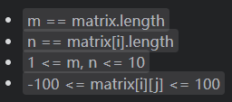

#### 题解
```python
class Solution:
    def spiralOrder(self, matrix: List[List[int]]) -> List[int]:
        res = []
        if matrix is None: return res
        top,bottom,left,right = 0, len(matrix) - 1, 0, len(matrix[0]) - 1
        while True:
            for i in range(left,right+1): #➡️
                res.append(matrix[top][i])
            top += 1 
            if top > bottom: break
            for i in range(top,bottom+1): #⬇️
                res.append(matrix[i][right])
            right -= 1
            if right < left: break
            for i in range(right,left-1,-1): #⬅️
                res.append(matrix[bottom][i])
            bottom -= 1
            if bottom < top: break
            for i in range(bottom,top-1,-1): #⬆️
                res.append(matrix[i][left])
            left += 1
            if left > right: break
        return res

```

### 合并区间

### 除自身以外数组的乘积

### 最后一块石头的重量 Ⅱ

## 字符串
### 整数转换英文表示

### 字符串相加

### 验证回文字符串 Ⅱ

### 最常见的单词

### 重新排列日志文件

## 链表
### 两数相加

### 无重复字符串的最长子串

### 删除链表的倒数第N个节点

### 合并两个有序链表

### 反转链表

## 堆与栈
### 20. 有效的括号 (Easy)
> [力扣链接](https://leetcode-cn.com/problems/valid-parentheses/solution/)
> 知识点：栈；哈希表；字符串
#### 题目描述
给定一个只包括 '('，')'，'{'，'}'，'['，']' 的字符串 s ，判断字符串是否有效。

有效字符串需满足：
1. 左括号必须用相同类型的右括号闭合。
2. 左括号必须以正确的顺序闭合。
 

示例 1：
```
输入：s = "()"
输出：true
```
示例 2：
```
输入：s = "()[]{}"
输出：true
```
示例 3：
```
输入：s = "(]"
输出：false
```
示例 4：
```
输入：s = "([)]"
输出：false
```
示例 5：
```
输入：s = "{[]}"
输出：true
```

提示：
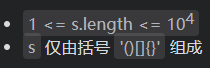

#### 题解
法一：直接遍历（慢）
```python
class Solution:
    def isValid(self, s: str) -> bool:
        if len(s)%2 != 0:
            return False
        while '()' in s or '[]' in s or '{}' in s:
            s = s.replace('[]','').replace('()','').replace('{}','')
        return True if s == '' else False
```
法二：字典（哈希表）
```python
class Solution:
    def isValid(self, s: str) -> bool:
		if len(s)%2 != 0: return False
        dic = {'{': '}',  '[': ']', '(': ')', '?': '?'}
        stack = ['?']
        for c in s:
            if c in dic: stack.append(c)
            elif dic[stack.pop()] != c: return False 
        return len(stack) == 1
```

### 会议室 Ⅱ

### 前K个高频单词

### 移除无效的括号

## 哈希表
### 1. 两数之和 (Easy)
> [力扣链接](https://leetcode-cn.com/problems/minimum-window-substring/solution/zui-xiao-fu-gai-zi-chuan-by-leetcode-solution/)
> 知识点：哈希表；字符串；滑动窗口
#### 题目描述

#### 题解


### 字母异位词分组

### 560. 和为K的子数组 (Medium)
> [力扣链接](https://leetcode-cn.com/problems/minimum-window-substring/solution/zui-xiao-fu-gai-zi-chuan-by-leetcode-solution/)
> 知识点：哈希表；字符串；滑动窗口
#### 题目描述

#### 题解


### 验证外星语词典

## 树
### 验证二叉搜索树

### 二叉树中的最大路径和

### 二叉树的右视图

### 二叉树的最近公共祖先

### 二叉树的直径

### 另一个树的子树

## 分治算法
### 合并K个排序链表

### 数组中的第K个最大元素

### 搜索二维矩阵 Ⅱ

### 最接近原点的K个点

## 回溯算法
### 电话号码的字母组合

### 括号生成

### 全排列

### 单词搜索

## 图论
### 单词接龙

### 火星词典

### 删除无效的括号

### 腐烂的橘子

### 查找集群内的关键链接

## 动态规划
### 最长回文子串

### 最小路径和

### 爬楼梯

### 编辑距离

### 单词拆分

### 零钱兑换

## 数学
### 整数反转

### 字符串转换整数

### 二进制求和

### 快乐数

## 模拟面试
### 翻转二叉树

### 93. 复原IP地址 (Medium)
> [力扣链接](https://leetcode-cn.com/problems/minimum-window-substring/solution/zui-xiao-fu-gai-zi-chuan-by-leetcode-solution/)
> 知识点：哈希表；字符串；滑动窗口
#### 题目描述

#### 题解


### 比较版本号

### 鸡蛋掉落

