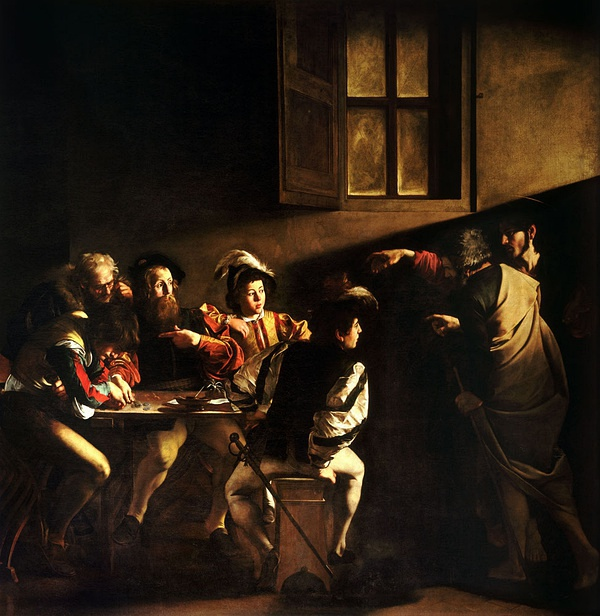

卡拉瓦乔将这一事件描述为一种近乎无声的、戏剧性的叙述。可以轻松且令人信服地重新创建这一时刻前后的动作序列。收税人列维（圣马太成为使徒之前的名字）和他的四个助手坐在一张桌子旁，计算着当天的收入，这群人从画作右上角的一个光源中点亮。基督，他的眼睛蒙着面纱，他的光环是唯一的神性暗示，与圣彼得一起进入。他右手的一个手势，由于它的疲倦而更加有力和引人注​​目，召唤了利维。对闯入感到惊讶，也许是被刚刚打开的门突然发出的光线弄得眼花缭乱，利威尔退后一步，用左手指了指自己，好像在说，“谁，我？”，

左边的两个数字源自 1545 年汉斯·霍尔拜因 (Hans Holbein) 的版画，代表不知道死亡出现的赌徒，他们非常关心数钱，以至于他们甚至没有注意到基督的到来；象征性地，他们对基督的漠视剥夺了他们获得永生的机会，并判处他们死刑。中间的两个男孩确实做出了回应，年轻的一个向利威尔退缩，好像在寻求他的保护，年长的那个大摇大摆，带着武器，有点威胁地向前倾身。圣彼得用力的比划着他的手，以平息他潜在的抵抗。这幅画的戏剧性之处在于，这一刻，没有人做任何事情。基督的出现是如此出人意料，他的姿态如此威严，以至于在反应发生之前暂停行动。再过一秒，利威尔就会站起来跟随基督——事实上，基督的脚已经转过身来，仿佛要离开房间。这幅画的特殊力量在于这种动作的停止。它利用基本静态的绘画媒介来传达人类在挑战或命令之后和反应之前的典型犹豫不决。

图片分为两部分。右边的站立人物形成一个垂直的矩形；那些聚集在桌子左边的水平块。服装加强了对比。卷入这个世界事务的利威尔和他的部下们穿着现代风格的衣服，而将利威尔召唤到另一个世界和世界的赤脚基督和圣彼得则穿着永恒的斗篷出现。这两个群体也被一个虚空隔开，由基督的手从字面上和象征性地连接起来。这只手，就像米开朗基罗《创造亚当》中的亚当一样，在形式上和心理上统一了两部分。在画面浅层似的空间之下，是纵横交错的格子图案，在结构上将其编织在一起。

光线也同样经过精心处理：可见的窗户覆盖着油皮，很可能在画家的工作室中提供漫射光；上方的灯，照亮圣马太的脸和坐着的人群；基督和圣彼得背后的光，只与他们一起介绍。这第三个光源可能是奇迹般的。否则，为什么圣彼得在面对他的防守青年身上没有任何阴影？

《圣马太蒙召》描绘的是耶稣收马太做门徒的场景。马太原名利未，是替罗马人当差向犹太人收税的税吏。画面中表现的是一群人正聚在一起赌博，这其实也是卡拉瓦乔熟悉的场景。突然间戏剧性场面出现了，耶稣推门而入，伸手一指马太，好象在说“你，跟我走！”，我们可以看到耶稣头顶上神圣的光环若隐若现，仿佛听到他低沉而不容置疑的声音。挡在他身前的是大徒弟彼得，他也用手指着前方，好象在说“是他吗？”。而此时利未正坐在人群的中间，用手指着自己，怀疑的目光似在询问“我？”。坐在桌子最左侧低头忙着数钱的正是年轻的犹大。这样的场景好似现代电影中的一个镜头，充满了戏剧性和紧迫感，它也是卡拉瓦乔作品最具代表性的风格，让观众仿佛置身画中，切身感受到当时的气氛。