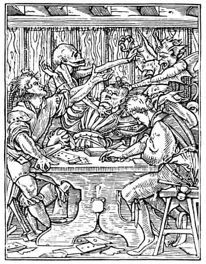
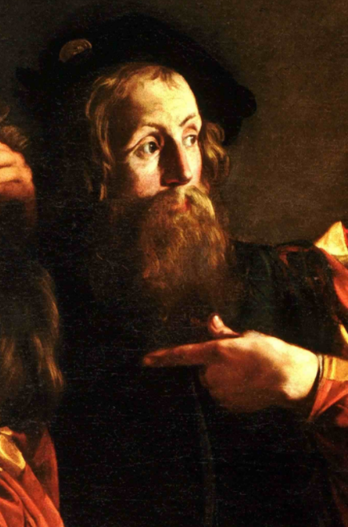
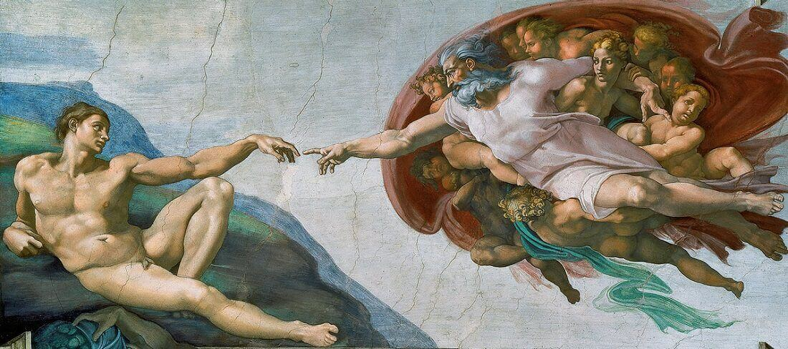
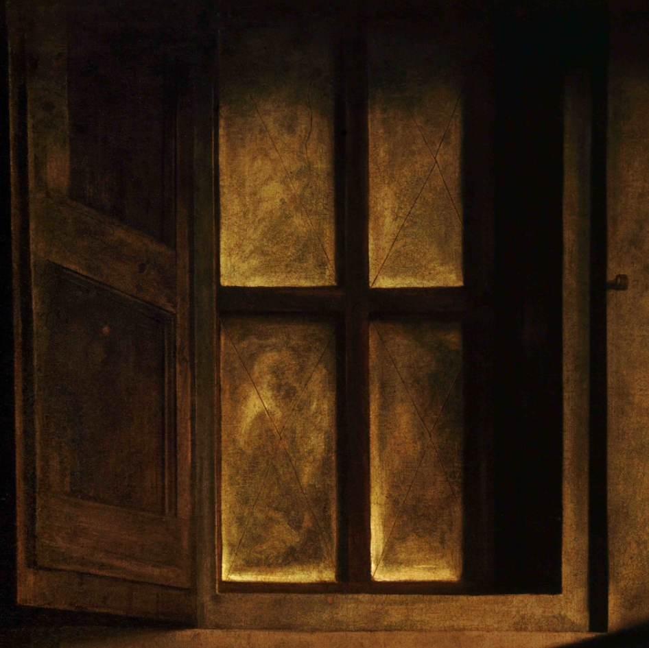
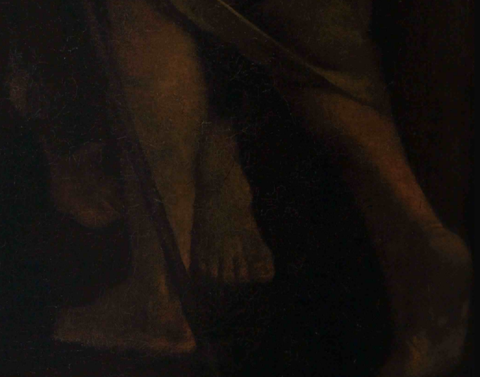

# 前言

人们或许听说过 **《马太福音》📕**，也听说过 **“马太效应”**。但是，关于【马太】这个人，却知之寥寥。【圣马太】(Saint Matthew) 是基督耶稣的十二使徒之一，也是第一卷福音书的作者。在成为耶稣的门徒之前，犹太人马太是迦百农的一名**税吏**💰，他终日坐在罗马税关之上，招呼着过往的人们缴税。而 **“马太效应”** 则出自 **《新约·马太福音》** 中的一句话：

> 凡有的，还要加倍给他叫他多余；没有的，连他所有的也要夺过来。

马太受耶稣感召的场景成为后世艺术家们津津乐道的题材。在 **《马太福音》** 中，对这个命运转变时刻的记录十分简略：

> 耶稣从那里往前走，看见一个人税吏，名叫利未，坐在税关上，就对他说，你跟从我来。他就起身跟从了耶稣。

【卡拉瓦乔】非常认同其中的思想，因为自身性格和相关经历，他很擅长刻画某种可能的==救赎==，这种救赎落在最不可能、最顽固的==罪人==身上。这幅画中，他描绘的是自己的本性，是自己熟悉的人物，是罗马现实生活中的场景，因而当时的看画人也会觉得，卡拉瓦乔的这幅画**连接了历史与当下，也连接了平凡与神圣。**

# 画面整体

卡拉瓦乔并没有沿用圣经中所描述的地点，而是**创造性地把场景设置在一个阴暗的角落里**，我们很难分辨这是室内还是室外，或许是破旧的酒馆，甚至可能是赌场的一隅。他将圣马太蒙召这一瞬间表现为一种==近乎无声的、戏剧性的叙述==，仿佛一切动态都在一瞬间被定格。收税人【利未】（Levi，圣马太成为使徒之前的名字）和他的四个随从围坐在一张桌子旁，桌上随意散落着金币，他们似乎正在专心致志地数着当天的收入。

突然，一束光自右上角射入，照亮了这群人；顺着光源的方向，我们就能看见耶稣——他与【圣彼得】一同进入，身着古旧的袍子，赤裸双脚，看上去与凡人别无二样，唯有 **==头顶的光环==暗示着他的神性**😇。他 **==右手==召唤马太的手势，仿佛由于无力和疲倦而显得更加具有神的力量**，引人注目。马太对这两位陌生人的闯入感到惊讶Σ(っ °Д °;)っ，也可能是被突然射入的强光炫得眼花缭乱。他身体后倾，用 **==左手==指了指自己**👈，好像在说，“谁？我？”，而他的 **==右手==仍停留在正在数着的金币上**，还没来得及反应。圣彼得也指向马太，同时转身对着耶稣，似乎在问：“是他吗？”🤔“对，就是你，马太！”**这三个人的手势让画面上的故事顿时生动起来，也将马太从世俗生活中剥离出来，从此税吏利未成为圣徒马太。** 这样的场景好似现代电影中的一个镜头📽️，充满了戏剧性和紧迫感，它也是卡拉瓦乔作品最具代表性的风格，让观众仿佛置身画中，切身感受到当时的气氛。

# 细节解读
## 桌子左边的数金币者

首先，我们来打量一下左边这两个头也不抬，一心数着金币的人。其中一个年长一些的，半弓着腰，眉头紧锁，严肃地抿着嘴。耶稣的圣光照得他那顶着稀稀疏疏银发的脑门子闪闪发光。他用手扶了扶眼镜，极力想数清桌上金币的数目，仿佛心里面在盘算着自己能分到多少银两。**他在视力和道德上都是极其短视的。** 另一位坐在桌子最左侧、低着头的小伙，眼睛死死地盯着桌上的金币，双肘将身体撑在桌子边缘，左手支在右臂后方，右手轻轻搭在桌上，整体呈现出蠢蠢欲动的状态，好像下一秒就要伸手去拿金币。**这两个人如此关心数钱，以至于他们甚至没有注意到耶稣的到来，他们对基督的漠视剥夺了他们获得永生的机会。**

某些艺术史学家认为，这两个人物可能在某种程度上**受到了【小汉斯·霍尔拜因】 (Hans Holbein the Younger) 的启发**✨。在荷尔拜因的 ==木版画[《死亡之舞》](http://godecookery.com/macabre/holdod/holdod.htm)之[十一《赌徒》](http://www.godecookery.com/macabre/holdod/holdod41.htm)== 中，三名赌徒坐在桌子旁边，死神和魔鬼为了抢夺中间这名赌徒而产生了争执，左边的这一位似乎在替他的同伴向死神说情，而右边的这一位则**闷着头计算着账目**，丝毫未注意到死神和魔鬼正在夺取他的朋友。这幅画以一种类似黑色幽默的手法，生动地讽刺了右边这位赌徒对金钱的痴迷，以致于**完全忽视了死神和魔鬼的降临**。

## 桌子右边的年轻男孩
桌子右边的两个男孩确实对耶稣的到来做出了回应。面向我们的、稍显年轻的这一个，粉嫩的小脸蛋被圣光照得通亮，他目不转睛地看着两位“不速之客”，下意识地靠向了马太，以寻得一丝安全感。他的手臂搭在马太的肩膀上，好像在说：“大哥，这两个人是不是来找你的啊？”

实际上，正脸面向我们的男孩，是卡拉瓦乔非常喜爱的一名男模特， ==【马里奥·明尼蒂 】(Mario Minniti)==，他曾在卡拉瓦乔的多幅作品中出现过，包括：
1. 《捧着水果篮的男孩》，1593， [*Boy with a Basket of Fruit 1593*](https://www.nbfox.com/boy-with-a-basket-of-fruit/)
2. 《算命者》，1594 & 1599，[*The Fortune Teller 1599* ](https://www.nbfox.com/the-fortune-teller-2/)
3. 《老千》，1594, 两个人物同一个模特，[*Cardsharps 1594*](https://www.nbfox.com/cardsharps/)
4. 《音乐家》，1595，两个人物同一个模特[*Musicians 1595*](https://www.nbfox.com/musicians-4/)
5. 《酒神巴库斯》，1596，[*Bacchus 1596*](https://www.nbfox.com/bacchus-2/)
6. 《被蜥蜴咬伤的男孩》，1596，[*Boy Bitten by a Lizard 1596*](https://www.nbfox.com/boy-bitten-by-a-lizard/)
7. 《鲁特琴演奏者》，1596，柏明顿庄园版，[*The Lute Player 1596, Ex-Badminton House, Gloucestershire*](https://artsviewer.com/caravaggio-15.html)
8. 《鲁特琴演奏者》，1596，Wildenstein版，[*The Lute Player 1596, Private Collection. Wildenstein Collection*](https://artsviewer.com/caravaggio-13.html)
9. 《圣马太蒙召》，1599，[*Calling of Saint Matthew 1599*](https://www.nbfox.com/calling-of-saint-matthew/)
10. 《圣马太殉难》，1599，[*Martyrdom of Saint Matthew 1599*](https://www.nbfox.com/martyrdom-of-saint-matthew/)

这里放上关于明尼蒂的一些补充介绍，主要聊了明尼蒂作为卡拉瓦乔的“御用”模特，都“参演过”哪些画作，感兴趣的朋友可以移步这篇文章。

> [Mario Minniti as a model in Caravaggio's works](http://www.cultorweb.com/Caravaggio/Ma.html)

而背对我们的、稍显年长的那一个男孩，则多了几分**痞气**。他上半身略带威胁地向着两位陌生人转去，左手下意识地摸向腰间的佩剑🗡，右手撑着凳子的一角，腿部肌肉和跟腱绷紧，左脚点地，仿佛就要起身。作为全场唯一一个佩戴了武器的人，他仿佛是专门坐在门口以防“分赃”过程被打断的“保安”🛡️，这样看来，他的**警觉和敌意**就显得十分自然了。

## 从利未到圣马太

我们可能会感到疑惑🤔：*为什么画面中的马太一脸讶异，为什么圣彼得要反复追问？* 原来，税吏这一职业在当时人们心目中是十分罪恶的，**税吏马太无疑会被人当作罪人**。而圣人耶稣竟然愿意感召一名罪人，就连马太自己也感到诚惶诚恐。😱

罗马共和国时期，一方面，国土不断扩张，大量的财富与人口涌入罗马，财政事务复杂；另一方面，系统完备的财政管理机构和制度始终没有形成，管理水平低下。大量的财富资源得不到有效合理的安排与利用，严重阻碍了罗马经济的健康发展。税负加重，人民生活日益贫困，消费市场日渐萎缩，农业衰落又使工商业生产原料减少，而手工业和商业的衰落进一步影响到帝国的税收收入，最终帝国的税收与财政到了崩盘的边缘。因此，**这个时代的税吏实属罪大恶极的职业**。😈

另一方面，这也体现了**耶稣的怜悯**。马太福音中记载了圣马太蒙召之后的一段故事：

> 为了感谢他（耶稣），马太在他家里举行了盛大的宴会。有好几个税吏和罪人和耶稣与他的门徒坐在一起。法利赛人和他们的文士看见了，就问耶稣的门徒：“你们的主人为什么与税吏和罪人一起吃饭呢？”当他听到这句话时，他回答说：“**需要医生的不是健康的人，而是病人**。去学习这句话的意思：怜悯是我所喜悦的，而不是牺牲。的确，**我不是来召叫正直人，而是召叫罪人**。”

我们再回到画面，当“信仰之光”✨打在马太困惑的脸上，他的两颊由于忽被“点名”而变得通红。对于神圣的召唤，他做出了每个罗马人、每个朝圣者都会认出的反应：“什么？我？”有些学者说，*此处的圣马太是谁其实难以确定*。也许这位大胡子男🧔🏼指向的是另一个人——桌子尽头弓着背的年轻人，嘴里说的是：“你是指他吗？”（暗示这位年轻人是马太）；还有一些人认为*卡拉瓦乔的画是故意模棱两可的*。但在我而言，毫无疑问，**即将成为门徒马太的就是这个满脸胡须的人**。因为他衣着华丽，也是卡拉瓦乔自己最喜欢的黑天鹅绒，这就使得税吏向谦卑的皈依更加生动。

## 耶稣右手与头顶的圣光
基督没有在画面正中，而是身处黑暗，这引得观者去寻找他的存在。**而那束光给了我们绝妙的提示**。从神学角度说，这是完美的处理，因为圣彼得介于众人和基督之间，就像他在教会制度中的作用一样。这种处理在心理层面也很出色，因为基督仅仅展现出部分身体，这就将大家的注意力都放在一个无法忽视的部位：他伸出的胳膊和有指向的手指。**这是神圣与世俗的完美结合，而且也正是整个故事的核心。** ==耶稣的这个手势源于米开朗基罗的西斯廷天顶画[《创造亚当》](https://www.michelangelo.org/the-creation-of-adam.jsp)==，**他伸出的右手，几乎是亚当左手的镜像**。==上帝的手指与亚当的手指即将触碰，象征着神的智慧和灵性即将随着灵魂一起注入人体；同样地，耶稣将这一手势传递下去，将神的宽恕给予他的使徒。==

卡拉瓦乔之所以在描摹耶稣时借用《创造亚当》中亚当的手势，是因为耶稣在新约中被描绘为==最后的亚当==或==第二个亚当==(the Last Adam/the Second adam)。在圣经新约中，保罗将耶稣和亚当进行了两次明确的比较：
>  因一人的悖逆，众人成为罪人；照样，因一人的顺从，众人也成为义了。
——罗马书 5:19

>在亚当里众人都死了。照样，在基督里众人也都要复活。
——哥林多前书 15:22

而在 45 节中，他称耶稣为 ==“最后的/终极的/最终的亚当” (the last/ultimate/final Adam)==。

我们再来看看卡拉瓦乔的**酒窖式光线**。在《圣马太蒙召》中，一束光线似乎自耶稣头顶（而不是来自肮脏的窗户），顺着他的手，射向了画面的左侧。这里很多学者曾对窗户的作用提出了疑问。有的人认为窗户是为了光线的漫反射而存在。但我觉得，比较令人信服的说法是，**这里暗淡的窗户象征着教会：它只是一种形式，并不能带来真正的光芒；真正的福音之光源自于基督，源自于对耶稣的信仰。**

# 特点总结
## 戏剧性和张力
**这幅画的戏剧性在于，这一刻，没有人做任何事情，但我们都能预见下一秒将发生什么。** 基督这一瞬时的出现是如此出人意料；他的姿态如此威严，以至于在场的每一个人在发生反应之前都暂停了行动。再过一秒，马太就会站起来跟随基督而去——**他腿部动势和肌肉的曲张已经暴露了这一点**。另外，仔细观察画面右下角也能发现，**基督的脚事实上已经调转了方向，仿佛就要离开这个房间**。他来此只是为了告知使徒他已被选中，不做任何停留，并且心里仿佛早就知道马太会毫不犹豫地跟随自己。**这幅画的特殊力量就在于这种动作的停止。有如牵丝木偶忽被拉紧了线，让人心头也倏地一震。** 之后的动作虽“呼之欲出”且“显而易见”，却也留足了悬念，给了观者思考与想象的空间。**==它利用了绘画最基本的静态感传达出了人类动态的情感——在面临挑战或命令，并且尚未来得及反应之时的，那种典型的内心矛盾与犹豫不决。==**

## 构图与对比
画面分为两部分。基督和圣彼得矗立在右侧，形成了一个**竖直的矩形**；画面左侧围坐在桌子旁的人们形成了一个**水平的模块**。卡拉瓦乔以鲜艳的**色彩**使这幅画栩栩如生：红色、金色和绿色的大胆对比。此外，天鹅绒和软毛皮等各种**质地**的服装也加强了人物的对比：**仍在世俗纷争中苦苦挣扎的利未和他的部下们，穿着具有当代风格的衣服；而基督和圣彼得，赤着双脚，身着具有象征意义和永恒性的斗篷，将利未召唤到另一个了无俗尘的世界。==这两个群体被一个虚空隔开，由基督的手从画面上并且从象征意义上连接了起来==。** 这只手，就像米开朗基罗《创造亚当》中，亚当的手一样，在形式上和心理上统一了两部分。在画面舞台式的空间之下，是纵横交错的网格布局，将整体在结构上编织在一起。

## 卡拉瓦乔的酒窖光线
画面的光线也同样经过精心处理：画面右上角的光源，**犹如酒窖掀开时，钻缝而入的光线一般**，投射在画面左侧人群的脸上，从而将圣马太和随从们脸部的神情展现地淋漓尽致。而这与基督一同进入了这间屋子的光，不是自然光也不是灯光，而是象征着上帝的、神圣的、奇迹般的光芒✨。*否则，为什么圣彼得没有在佩剑男孩身上投下影子呢？*

